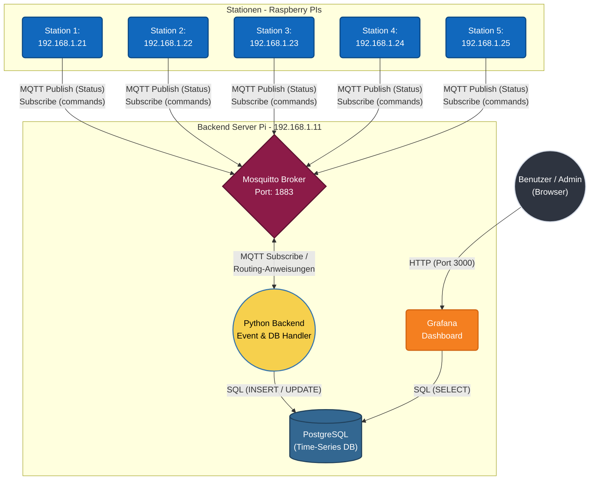
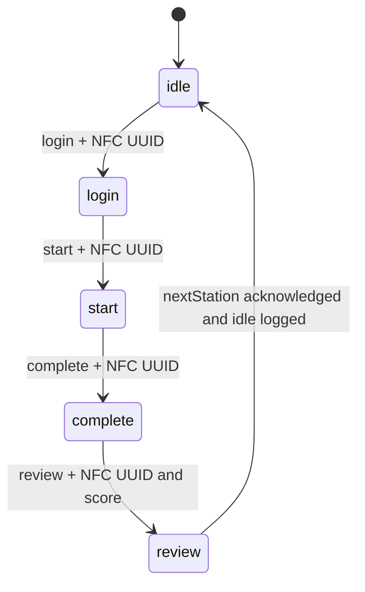
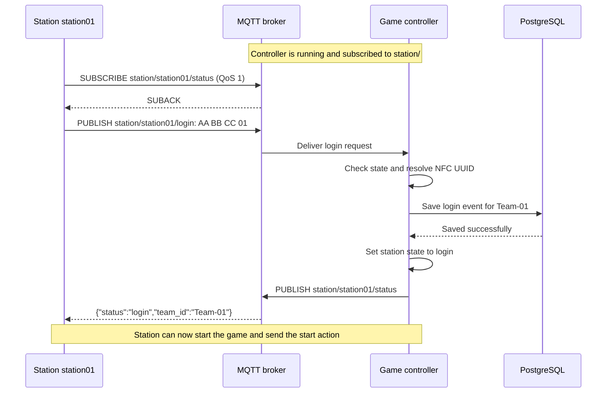
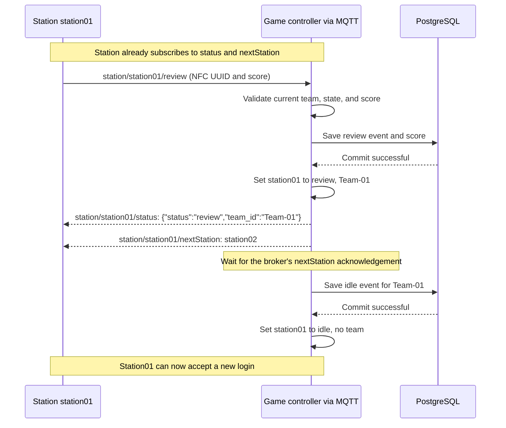
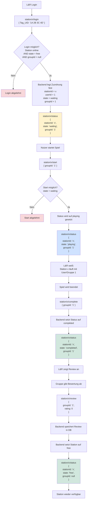

# Backend service
Backend for the school project

MQTT-Broker/Backend Server: **192.168.1.11:1883** <br>
Station 1 - xxxxxxxxxxxxxx: **192.168.1.21**<br>
Station 2 - xxxxxxxxxxxxxx: **192.168.1.22**<br>
Station 3 - xxxxxxxxxxxxxx: **192.168.1.23**<br>
Station 4 - xxxxxxxxxxxxxx: **192.168.1.24**<br>
Station 5 - xxxxxxxxxxxxxx: **192.168.1.25**<br>

Dashboard: Grafana<br>
Database: PostgreSQL (Time series database for grafana)<br>
Backend Service: Python (handles events & database handling)<br>
MQTT-broker: mosquitto





## MQTT integration guide for station groups

This section describes the station protocol, including the new `nextStation`
handoff after review, the [broker permissions](mosquitto/config/mosquitto.acl), and
the separate [server-time service](mqtt-test/servertime/servertime.py). All examples use station 1.
Replace `station01` with your group's assigned station ID everywhere, including the MQTT username.

The next-station handoff and automatic reset to `idle` are implemented in
[gameController/gameLogic.py](gameController/gameLogic.py). The ACL permits the
backend to publish destinations, and the action test client waits for both the
review confirmation and the next-station message.

### 1. Connect to the broker

| Setting | Value |
| --- | --- |
| Broker on the server Pi | `192.168.1.11` |
| Broker on your own computer, including local Docker | `localhost` |
| Port / transport | `1883`, MQTT over TCP, without TLS |
| MQTT version used by the example clients | MQTT 3.1.1 |
| Username | Your station ID: `station01`, `station02`, ..., `station05` |
| Password in the supplied broker image | `testen123` |
| Client ID | A unique ID for each connected client, e.g. `station01-game` |
| Publish / subscribe QoS | Use `1` |
| Retain flag | Always publish requests with `retain=false` |

`localhost` means the machine running your client. A station Pi connecting to the
server Pi must use `192.168.1.11`, even if the station software itself runs locally.
The Docker service name `mosquitto` works inside the backend's Compose network.
The Compose stack exposes port 1883; its configured WebSocket listener on 9001 is
not published to other machines by the current Compose file.

The username determines topic permissions. For example, `station02` can publish
actions for `station/station02/...` and read its own replies. Use the exact spelling:
`station01`, not `station1`, `1`, or `station-01`. Stations do not need the `backend`
account or a subscription to `station/#`.

### 2. Topic reference

`<station_id>` below is a placeholder, for example `station01`. Topic names are case-sensitive.
Action requests are UTF-8 plain text. Do not wrap an NFC UUID in JSON or send a team name.

| Topic | What the station does | Request payload example | Where the reply arrives |
| --- | --- | --- | --- |
| `station/<station_id>/login` | Publish to register a team at the station | `AA BB CC 01` | `station/<station_id>/status` |
| `station/<station_id>/start` | Publish when that team's game starts | `AA BB CC 01` | `station/<station_id>/status` |
| `station/<station_id>/complete` | Publish when that team's game finishes | `AA BB CC 01` | `station/<station_id>/status` |
| `station/<station_id>/review` | Publish the team's review score after completion | `AA BB CC 01;2` | `station/<station_id>/status` |
| `station/<station_id>/status` | Subscribe for action replies; publish `1` to query current state | `1` | Same topic, as JSON |
| `station/<station_id>/nextStation` | Subscribe for the destination sent automatically after a successful review | No station request | Same topic, as plain text, e.g. `station02` |
| `station/<station_id>/servertime` | Subscribe for time replies; publish a JSON time request | `{"request":"GET"}` | Same topic, as JSON |

Stations have publish permission on the four action topics, and publish/subscribe
permission on their own `status` and `servertime` topics. Stations only subscribe
to their own `nextStation` topic; the backend publishes to it. The required backend ACL
rule for that output is `topic write station/+/nextStation`, and the station rule
is `pattern read station/%u/nextStation`. There are no replies on the action topics
themselves. The separate `servertime` topic remains available.

### 3. Game actions and their required order

Each station has its own state. A newly started controller initializes all stations
to `idle`. Station requests follow this order; the final reset is an automatic
controller action:



| Publish action | Allowed current state | Meaning and payload |
| --- | --- | --- |
| `login` | `idle` | Send the scanned NFC UUID to register the team. The controller resolves the team name. |
| `start` | `login` | Send an NFC UUID belonging to the logged-in team when your station starts its game. |
| `complete` | `start` | Send an NFC UUID belonging to the same team when the game finishes. |
| `review` | `complete` | Send `<NFC UUID>;<score>`, e.g. `AA BB CC 01;2`. The score must be exactly `0`, `1`, or `2`. |

The protocol defines the numeric review values but does not assign them UI labels.
Agree on the meaning of 0, 1, and 2 with the project team. The score is saved in the
database; it is not included in the MQTT status reply.

The station stays occupied by the logged-in team through `login`, `start`,
`complete`, and the review handoff. New logins and out-of-order actions are ignored
while it is occupied. A successful review finishes the visit in this order:

1. Validate the review and save it in PostgreSQL.
2. Set the station state to `review`, keeping the current team ID.
3. Publish `{"status":"review","team_id":"Team-01"}` on the station's `/status` topic.
4. Automatically publish the next station's name on the **sending station's**
   `/nextStation` topic. For example, publish plain text `station02` to
   `station/station01/nextStation`.
5. Wait for the broker to acknowledge the QoS-1 destination message, save an `idle`
   event, and reset the original station to `{"status":"idle","team_id":null}`
   so it can accept the next login. The `idle` log entry records the team that
   finished the visit; the live state clears the team ID.

`nextStation` is a separate output topic, not a value of the `status` field. The
station does not send a next-station request or an `idle` action. There is no
separate application-level acknowledgement for the destination in this protocol.
The broker's acknowledgement confirms receipt by the broker, not that the station
application has processed the destination. While that acknowledgement or the
`idle` database write is pending, a status query still returns `review`.

For now, routing simply uses the next station number: `station01` goes to
`station02`, and the last configured station goes back to `station01`. The routing
decision will later be replaced by the game logic; it does not reserve the next
station or log the team in there.

NFC UUIDs must match entries in [gameController/config.py](gameController/config.py)
under `NFC_TEAMS`. The current test mappings are:

| NFC UUID sent by the station | Team ID returned by the controller |
| --- | --- |
| `AA BB CC 01` | `Team-01` |
| `AA BB CC 02` | `Team-02` |
| `AA BB CC 03` | `Team-03` |
| `AA BB CC 04` | `Team-04` |
| `AA BB CC 05` | `Team-05` |

These are example chip IDs. Give your real NFC UUIDs to the backend group so they
can configure the mapping. Matching is case-sensitive and internal spaces matter;
the controller only removes surrounding whitespace. A station number and a team
number are independent: any configured team can log in at any available station.

### 4. Status replies and read-only queries

Subscribe to `station/<station_id>/status` and `station/<station_id>/nextStation`
**before publishing actions**. Wait for the broker's subscription acknowledgement
(SUBACK), then send the request. After all checks pass, the database commit succeeds,
and the new state is set, the controller automatically publishes a JSON status reply:

```json
{"status":"login","team_id":"Team-01"}
```

| Field | Meaning |
| --- | --- |
| `status` | `idle`, `login`, `start`, `complete`, `review`, or `error` |
| `team_id` | The resolved team name, or JSON `null` if no team is assigned/identified |

The topic identifies the station. The reply has no `station_id`, NFC UUID,
request ID, timestamp, review score, or detailed error message.

To ask for the current state without changing it, publish the single character
`1` to `station/<station_id>/status`. This is plain text, not the JSON string `"1"`
and not `{"request":"GET"}`. For an unused station, the reply is:

```json
{"status":"idle","team_id":null}
```

Because queries and replies use the same topic, your subscription can receive your
own `1` message. Ignore it. Accept only JSON objects with the expected `status` and
`team_id` fields, and ignore retained messages. The controller's status replies use
QoS 1 and `retain=false`; subscribing alone does not request a fresh status.

The review reply confirms that the review was accepted. It is followed by the
plain-text destination on `/nextStation` and the controller's reset to `idle`.
A status query after that reset returns `{"status":"idle","team_id":null}`;
it does not repeat the previous review reply or destination.

### 5. Example: one complete station visit

The message flow for a successful login is:



Connect as `station01`, subscribe to both `station/station01/status` and
`station/station01/nextStation`, and wait for SUBACK.
Then perform these steps, waiting for the matching JSON reply before advancing:

| Step | Publish topic | Exact request payload | Expected JSON reply on `station/station01/status` |
| --- | --- | --- | --- |
| Check initial state | `station/station01/status` | `1` | `{"status":"idle","team_id":null}` on a fresh controller |
| Scan the team's chip | `station/station01/login` | `AA BB CC 01` | `{"status":"login","team_id":"Team-01"}` |
| Start the game | `station/station01/start` | `AA BB CC 01` | `{"status":"start","team_id":"Team-01"}` |
| Finish the game | `station/station01/complete` | `AA BB CC 01` | `{"status":"complete","team_id":"Team-01"}` |
| Submit the review | `station/station01/review` | `AA BB CC 01;2` | `{"status":"review","team_id":"Team-01"}`; then wait for the destination on `/nextStation` |
| Check state after the handoff | `station/station01/status` | `1` | `{"status":"idle","team_id":null}` |

The end of the visit is automatic after the single review request:



Keep the station connection open to receive both the review status and the
next-station destination. Read the `/status` payload as JSON and the `/nextStation`
payload as a plain UTF-8 station name, without JSON quotes or an object wrapper.
The backend sends both messages with QoS 1 and `retain=false`.

Once the handoff resets the station to `idle`, the next team can send `login`.
Run one action at a time for each station:
there are no request IDs to distinguish concurrent requests. Check both the status
and team ID when matching an action reply. An MQTT publish acknowledgement confirms
broker delivery; use the JSON reply to confirm that the controller accepted the action.

### 6. Errors, timeouts, and reconnects

An error reply looks like this:

```json
{"status":"error","team_id":null}
```

A database failure can instead include the resolved team ID. `error` is a reply,
not a stored station state: failed actions leave the previous state unchanged.

| Situation | Current controller behavior | What the station should do |
| --- | --- | --- |
| Unknown NFC UUID during an allowed login | Replies with `error` and `team_id: null` | Check the scanned UUID and backend mapping. |
| Invalid UTF-8 or malformed review/score during the expected action | Replies with `error` and `team_id: null` | Correct the payload format. |
| Saving a requested station action fails | Replies with `error` and the resolved team ID | Keep the previous local state and contact the backend group if it persists. |
| Review reply or next-station publish fails, the destination acknowledgement is missing, or saving the final `idle` event fails | Station remains in `review`; it is not released early | Query `status` and contact the backend group. The handoff is not automatically retried. |
| Wrong action order, or a repeated action that is no longer the expected next action | Silently ignored; no reply | Query `status` to recover the actual state. |
| A different or unmapped team sends `start`, `complete`, or `review` with an otherwise valid payload | Silently ignored; no reply | Use the team that logged in. |
| Invalid station ID/topic, unsupported action, or a message delivered with its retained flag set | Ignored by the controller; permissions may also prevent delivery | Check the topic, credentials, and `retain=false`. |
| Broker is reachable but controller is unavailable | No game status reply | Check controller availability with the backend group. |

Start a reply timeout after sending a request; the provided clients use five seconds.
If no reply arrives, query `status` before deciding whether to retry: the controller
may have accepted the action even if your client missed its reply. Handle duplicate
deliveries without repeating physical game effects.

After a review, the station may already be back at `idle`. That status alone does
not contain the destination. If the next-station message was missed, contact the
backend group; resending review while the station is `idle` is out of order and
does not request another destination.

After reconnecting, subscribe again, wait for SUBACK, and query `status`. Current
station states live only in controller memory. Restarting the controller resets
them to `idle`; database history is not loaded back into the state machine.

### 7. Server time (optional, separate service)

The time topic is handled by [mqtt-test/servertime/servertime.py](mqtt-test/servertime/servertime.py),
not by the game controller. **The current Docker Compose stack does not start this
service.** Ask the backend group to start it if your station needs server time.
On the broker host, with `paho-mqtt` installed and `BROKER_IP` configured in that script:

```sh
python mqtt-test/servertime/servertime.py
```

Subscribe to `station/station01/servertime`, wait for SUBACK, and publish this JSON
object to the same topic with QoS 1 and `retain=false`:

```json
{"request":"GET"}
```

The service replies on that same topic with JSON in this form (example timestamp):

```json
{"request":"POST","server_time":"2026-01-01T00:00:00Z","unix":1767225600}
```

`server_time` is a UTC date/time string; `unix` is seconds since the Unix epoch.
Ignore your echoed `GET` request and only process objects with `request: "POST"`.
Time queries do not change game state and do not produce a reply on `/status`.
This service expects JSON objects, so do not send the plain `1` used by status queries.

### 8. Try the protocol with the supplied clients

The game clients provide working examples of subscribing before publishing,
formatting action payloads, filtering replies, and waiting for a response.
From the repository root, install their dependency:

```sh
python -m pip install paho-mqtt==2.1.0
```

Set `MQTT_HOST` near the top of both [clientStatus.py](gameClient/clientStatus.py)
and [clientLogin.py](gameClient/clientLogin.py) to `"192.168.1.11"` for the server Pi,
or `"localhost"` for a broker on your own machine. Then run:

```sh
# Read current state; enter your station ID when prompted.
python gameClient/clientStatus.py

# Send one action; prompts ask for station ID, action, NFC UUID, and review score if needed.
python gameClient/clientLogin.py
```

Run the action client once per step in the example visit. Its default NFC UUID is
`AA BB CC 01`; use a UUID registered by the backend group for real hardware.
For `review`, the action client subscribes to both `/status` and `/nextStation`
before publishing. It prints the JSON review confirmation and the plain-text
destination, then disconnects once both have arrived. It handles either arrival
order and reports a timeout if either reply is missing. Other actions still wait
only for their automatic JSON status reply; `clientStatus.py` remains a separate
read-only query tool.

After changing controller code or the ACL, rebuild the two services on the backend host:

```sh
docker compose up -d --build mosquitto game-controller
```

For a time-client example, see [servertimeReq.py](mqtt-test/servertime/servertimeReq.py).

The older [mqtt-test/main.py](mqtt-test/main.py) and [mqtt-test/test_pub.py](mqtt-test/test_pub.py)
use a different JSON action format. Their `backend/timestamp` routing topic and
JSON `next_station` messages are different from the new station-specific
`station/<station_id>/nextStation` topic and its plain-text payload. Use the topics
and plain-text action payloads documented above for new station implementations.

# grafana

## datasource setup
- Grafana website -> http://localhost:3000/ <br>
- Connections -> Add new Datasource <br>
```
Host URL:   'postgres:5432'
DB name:    'stations'
Username:   'stationuser'
Password:   'changeme'
TLS/SSL:     disable
```
<br>
After that import the test dashboard (or any other from us) <br>
(you may have to click on every panel and click 'run query' once for it to show default data) <br>

# Flowchart for one Station (design draft from main)

This draft uses different payloads and state names from the current controller.
For the implemented MQTT protocol, use the integration guide above.


