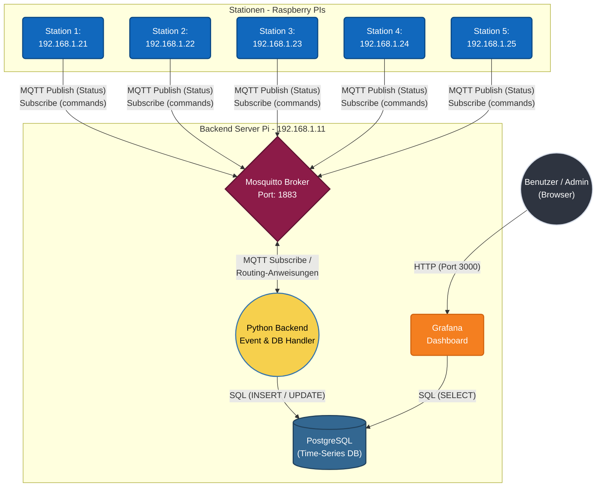

# Backend service
Backend for the school project

MQTT-Broker/Backend Server: **192.168.1.11:1883** <br>
Station 1 - xxxxxxxxxxxxxx: **192.168.1.21**<br>
Station 2 - xxxxxxxxxxxxxx: **192.168.1.22**<br>
Station 3 - xxxxxxxxxxxxxx: **192.168.1.23**<br>
Station 4 - xxxxxxxxxxxxxx: **192.168.1.24**<br>
Station 5 - xxxxxxxxxxxxxx: **192.168.1.25**<br>

Dashboard: Grafana<br>
Database: PostgreSQL (Time series database for grafana)<br>
Backend Service: Python (handles events & database handling)<br>
MQTT-broker: mosquitto





# grafana

## datasource setup
- Grafana website -> http://localhost:3000/ <br>
- Connections -> Add new Datasource <br>
```
Host URL:   'postgres:5432'
DB name:    'stations'
Username:   'stationuser'
Password:   'changeme'
TLS/SSL:     disable
```
<br>
After that import the test dashboard (or any other from us) <br>
(you may have to click on every panel and click 'run query' once for it to show default data) <br>