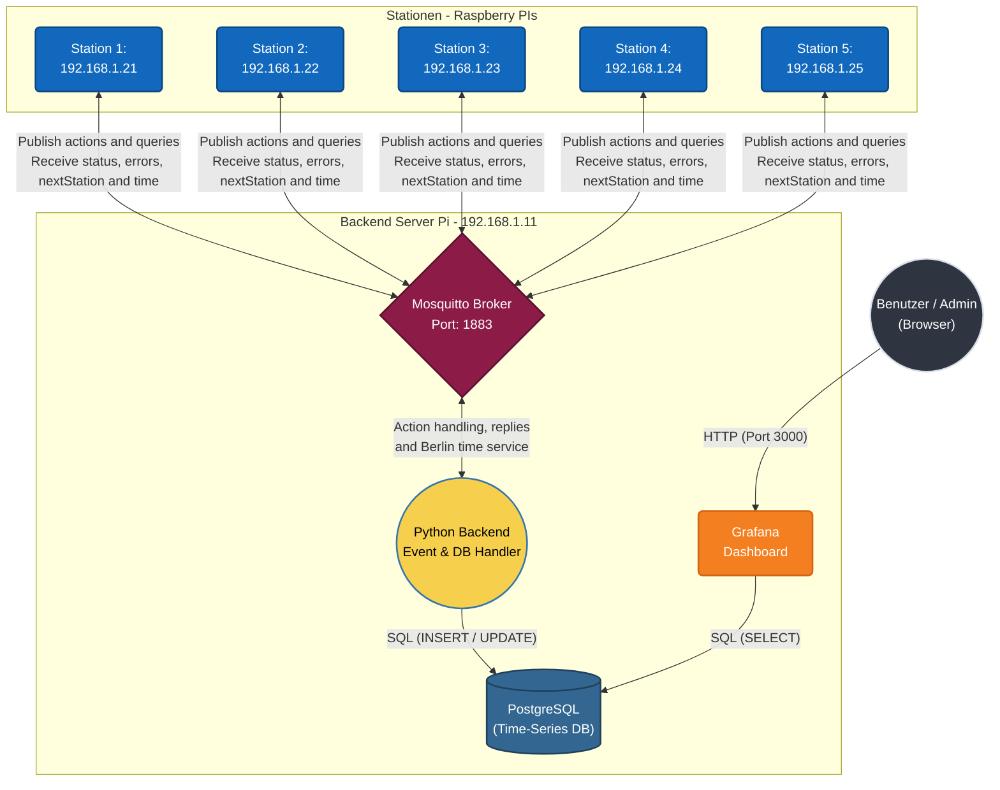
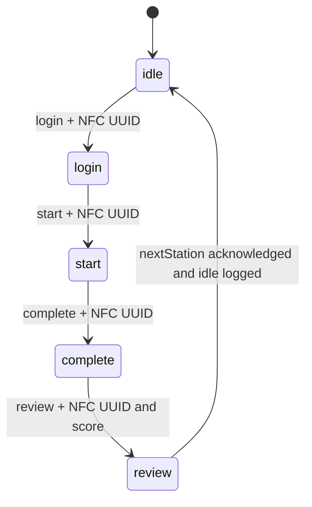
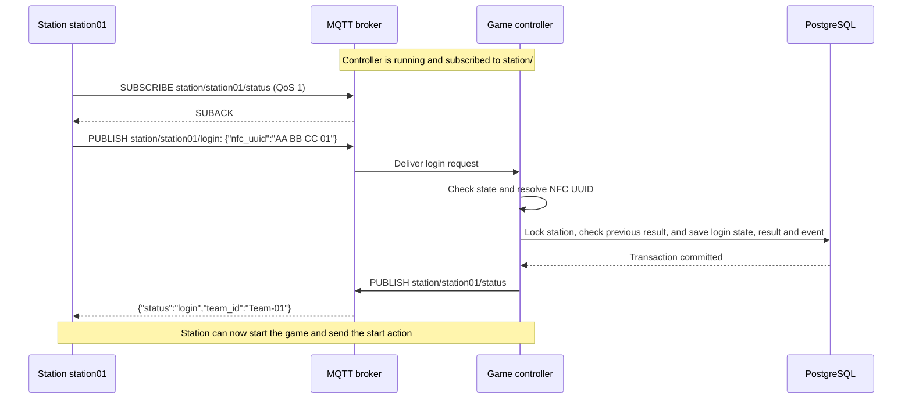
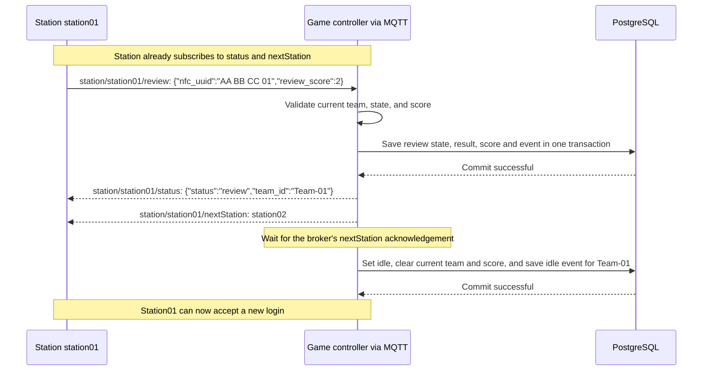
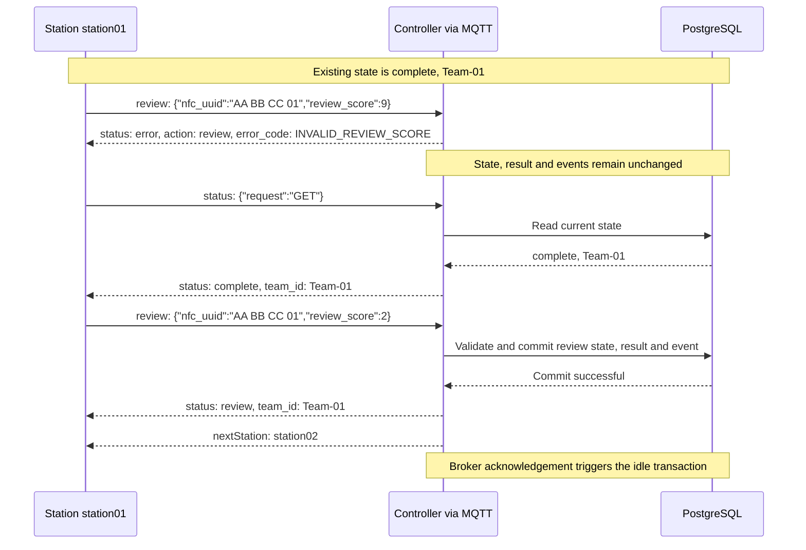
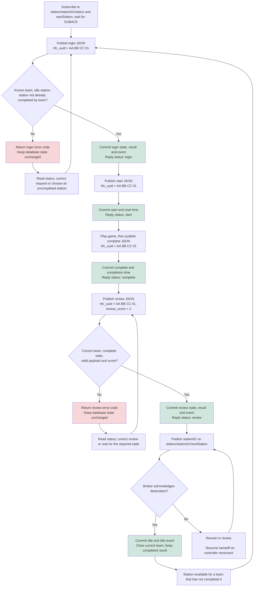

# Backend service
Backend for the school project

MQTT-Broker/Backend Server: **192.168.1.11:1883** <br>
Station 1 - xxxxxxxxxxxxxx: **192.168.1.21**<br>
Station 2 - xxxxxxxxxxxxxx: **192.168.1.22**<br>
Station 3 - xxxxxxxxxxxxxx: **192.168.1.23**<br>
Station 4 - xxxxxxxxxxxxxx: **192.168.1.24**<br>
Station 5 - xxxxxxxxxxxxxx: **192.168.1.25**<br>

Dashboard: Grafana<br>
Database: PostgreSQL (Time series database for grafana)<br>
Backend Service: Python (handles events & database handling)<br>
MQTT-broker: mosquitto

## Guide contents

- [Backend service](#backend-service)
  - [Guide contents](#guide-contents)
  - [MQTT integration guide for station groups](#mqtt-integration-guide-for-station-groups)
    - [1. Connect to the broker](#1-connect-to-the-broker)
    - [2. Topic reference](#2-topic-reference)
    - [3. Game actions and their required order](#3-game-actions-and-their-required-order)
    - [4. Status replies and read-only queries](#4-status-replies-and-read-only-queries)
    - [5. Example: one complete station visit](#5-example-one-complete-station-visit)
    - [6. Errors, timeouts, and reconnects](#6-errors-timeouts-and-reconnects)
      - [Example: correct a rejected review](#example-correct-a-rejected-review)
    - [7. Server time (Berlin time, included in the controller container)](#7-server-time-berlin-time-included-in-the-controller-container)
    - [8. Try the protocol with the supplied clients](#8-try-the-protocol-with-the-supplied-clients)
    - [9. Communication test](#9-communication-test)
- [Database schema](#database-schema)
    - [Current state, results, and events](#current-state-results-and-events)
- [grafana](#grafana)
  - [datasource setup](#datasource-setup)
- [Flowchart for one station](#flowchart-for-one-station)





## MQTT integration guide for station groups

This section describes the station protocol, including the `nextStation`
handoff after review, the [broker permissions](mosquitto/config/mosquitto.acl), and
the separate [server-time script](gameController/servertime.py) and
[communication test service](gameController/communication_test.py). All examples use station 1.
Replace `station01` with your group's assigned station ID everywhere, including the MQTT username.

The next-station handoff and automatic reset to `idle` are implemented in
[gameController/gameLogic.py](gameController/gameLogic.py). The ACL permits the
backend to publish destinations, and the action test client waits for both the
review confirmation and the next-station message.

### 1. Connect to the broker

| Setting | Value |
| --- | --- |
| Broker on the server Pi | `192.168.1.11` |
| Broker on your own computer, including local Docker | `localhost` |
| Port / transport | `1883`, MQTT over TCP, without TLS |
| MQTT version used by the example clients | MQTT 3.1.1 |
| Username | Your station ID: `station01`, `station02`, ..., `station05` |
| Password in the supplied broker image | `testen123` |
| Client ID | A unique ID for each connected client, e.g. `station01-game` |
| Publish / subscribe QoS | Use `1` |
| Retain flag | Always publish requests with `retain=false` |

`localhost` means the machine running your client. A station Pi connecting to the
server Pi must use `192.168.1.11`, even if the station software itself runs locally.
The Docker service name `mosquitto` works inside the backend's Compose network.
The Compose stack exposes port 1883; its configured WebSocket listener on 9001 is
not published to other machines by the current Compose file.

The username determines topic permissions. For example, `station02` can publish
actions for `station/station02/...` and read its own replies. Use the exact spelling:
`station01`, not `station1`, `1`, or `station-01`. Stations do not need the `backend`
account or a subscription to `station/#`.

### 2. Topic reference

`<station_id>` below is a placeholder, for example `station01`. Topic names are case-sensitive.
Game actions, status queries, and time queries are UTF-8 JSON objects. The `/test`
topic uses plain `1` and `2` instead. Use the exact field names
below for JSON requests. The MQTT topic selects the action and station; send the NFC UUID in
`nfc_uuid`, not a team name or a nested object.

| Topic | What the station does | Request payload example | Where the reply arrives |
| --- | --- | --- | --- |
| `station/<station_id>/login` | Publish to register a team at the station | `{"nfc_uuid":"AA BB CC 01"}` | `station/<station_id>/status` |
| `station/<station_id>/start` | Publish when that team's game starts | `{"nfc_uuid":"AA BB CC 01"}` | `station/<station_id>/status` |
| `station/<station_id>/complete` | Publish when that team's game finishes | `{"nfc_uuid":"AA BB CC 01"}` | `station/<station_id>/status` |
| `station/<station_id>/review` | Publish the team's review score after completion | `{"nfc_uuid":"AA BB CC 01","review_score":2}` | `station/<station_id>/status` |
| `station/<station_id>/status` | Subscribe for action replies; publish a JSON GET to query state | `{"request":"GET"}` | Same topic, as JSON |
| `station/<station_id>/nextStation` | Subscribe for the destination sent automatically after a successful review | No station request | Same topic, as plain text, e.g. `station02` |
| `station/<station_id>/servertime` | Subscribe for time replies; publish a JSON time request | `{"request":"GET"}` | Same topic, as JSON |
| `station/<station_id>/test` | Subscribe, then publish plain `1` to check communication | `1` (no quotes or JSON wrapper) | Same topic, plain `2` |

Request fields:

| Field | JSON type | Used by |
| --- | --- | --- |
| `nfc_uuid` | Non-empty string | Required for login, start, complete, and review. Surrounding whitespace is trimmed. |
| `review_score` | Integer `0`, `1`, or `2` | Required for review. `"2"`, `2.0`, `true`, and `null` are invalid. |
| `request` | String `"GET"` | Status and server-time queries. The status query must contain only this field. |

For example, a review request is:

```json
{"nfc_uuid":"AA BB CC 01","review_score":2}
```

The old bare UUID, semicolon-separated review, and plain `1` status request are
no longer accepted. Update station publishers together with the backend.
Extra action fields are ignored; they cannot override the station or action in
the topic. Replies keep their existing formats: status/errors and time are JSON,
and the backend's `nextStation` destination is still plain text.

Stations have publish permission on the four action topics, and publish/subscribe
permission on their own `status`, `servertime`, and `test` topics. Stations only subscribe
to their own `nextStation` topic; the backend publishes to it. The required backend ACL
rule for that output is `topic write station/+/nextStation`, and the station rule
is `pattern read station/%u/nextStation`. There are no replies on the action topics
themselves. The separate `servertime` topic remains available.

### 3. Game actions and their required order

Each station has its own persistent database state. New station rows start at
`idle`; restarting the controller preserves existing states, results, and completed
visits. Station requests follow this order; the final reset is an automatic
controller action after the destination message is acknowledged by the broker:



| Publish action | Allowed current state | Meaning and payload |
| --- | --- | --- |
| `login` | `idle` | Send the scanned NFC UUID to register the team. The controller resolves the team name. |
| `start` | `login` | Send an NFC UUID belonging to the logged-in team when your station starts its game. |
| `complete` | `start` | Send an NFC UUID belonging to the same team when the game finishes. |
| `review` | `complete` | Send `{"nfc_uuid":"AA BB CC 01","review_score":2}`. The score must be a JSON integer: `0`, `1`, or `2`. |

A team can complete each station **only once per run**. After Team-01 completes
station01, playing station02 does not allow it to return and play station01 again.
A repeat login at an idle station returns `status: "error"`, `team_id: "Team-01"`,
and `error_code: "STATION_ALREADY_COMPLETED"` on that station's `/status` topic.
The station stays idle, and the original result, timings, and review remain
unchanged. Other teams can still play that station.

The protocol defines the numeric review values but does not assign them UI labels.
Agree on the meaning of 0, 1, and 2 with the project team. The score is saved in the
database; it is not included in the MQTT status reply.

The station stays occupied by the logged-in team through `login`, `start`,
`complete`, and the review handoff. A new login while occupied receives
`STATION_BUSY`; an out-of-order review receives `INVALID_STATE`. Out-of-order
`start`/`complete` requests remain silently ignored.
A successful review finishes the visit in this order:

1. Validate the review and save it in PostgreSQL.
2. Set the station state to `review`, keeping the current team ID.
3. Publish `{"status":"review","team_id":"Team-01"}` on the station's `/status` topic.
4. Automatically publish the next station's name on the **sending station's**
   `/nextStation` topic. For example, publish plain text `station02` to
   `station/station01/nextStation`.
5. Wait for the broker to acknowledge the QoS-1 destination message, save an `idle`
   event, and reset the original station to `{"status":"idle","team_id":null}`
   so it can accept the next login. The `idle` log entry records the team that
   finished the visit; the live state clears the team ID.

`nextStation` is a separate output topic, not a value of the `status` field. The
station does not send a next-station request or an `idle` action. There is no
separate application-level acknowledgement for the destination in this protocol.
The broker's acknowledgement confirms receipt by the broker, not that the station
application has processed the destination. While that acknowledgement or the
`idle` database write is pending, a status query still returns `review`.

For now, routing simply uses the next station number: `station01` goes to
`station02`, and the last configured station goes back to `station01`. This rule
does not check availability or skip stations the team has already completed. It
does not reserve the destination or log the team in there. A team directed back
to a completed station will receive `STATION_ALREADY_COMPLETED` when it tries to
log in. There is currently no automatic end-of-run message or new-run command.

NFC UUIDs must match entries in [gameController/config.py](gameController/config.py)
under `NFC_TEAMS`. The current test mappings are:

| NFC UUID sent by the station | Team ID returned by the controller |
| --- | --- |
| `AA BB CC 01` | `Team-01` |
| `AA BB CC 02` | `Team-02` |
| `AA BB CC 03` | `Team-03` |
| `AA BB CC 04` | `Team-04` |
| `AA BB CC 05` | `Team-05` |

These are example chip IDs. Give your real NFC UUIDs to the backend group so they
can configure the mapping. Matching is case-sensitive and internal spaces matter;
the controller only removes surrounding whitespace. A station number and a team
number are independent: a configured team can log in at an idle station it has
not already completed in the current run.

### 4. Status replies and read-only queries

Subscribe to `station/<station_id>/status` and `station/<station_id>/nextStation`
**before publishing actions**. Wait for the broker's subscription acknowledgement
(SUBACK), then send the request. After all checks pass, the database commit succeeds,
and the new state is set, the controller automatically publishes a JSON status reply:

```json
{"status":"login","team_id":"Team-01"}
```

| Field | Meaning |
| --- | --- |
| `status` | `idle`, `login`, `start`, `complete`, `review`, or `error` |
| `team_id` | The resolved team name, or JSON `null` if no team is assigned/identified |

The topic identifies the station. Successful replies have no `station_id`, NFC UUID,
request ID, timestamp, or review score. Login/review errors add `action`,
`error_code`, and `message`, as documented in section 6.

To ask for the current state without changing it, publish exactly
`{"request":"GET"}` to `station/<station_id>/status`. Only this JSON object is a
status query; other messages on this shared topic are ignored to prevent reply
loops. For an unused station, the reply is:

```json
{"status":"idle","team_id":null}
```

Because queries and replies use the same topic, your subscription can receive your
own `{"request":"GET"}` message. Ignore it. Accept only JSON objects with the expected `status` and
`team_id` fields, and ignore retained messages. The controller's status replies use
QoS 1 and `retain=false`; subscribing alone does not request a fresh status.

The review reply confirms that the review was accepted. It is followed by the
plain-text destination on `/nextStation` and the controller's reset to `idle`.
A status query after that reset returns `{"status":"idle","team_id":null}`;
it does not repeat the previous review reply or destination.

### 5. Example: one complete station visit

The message flow for a successful login is:



Connect as `station01`, subscribe to both `station/station01/status` and
`station/station01/nextStation`, and wait for SUBACK.
Then perform these steps, waiting for the matching JSON reply before advancing:

| Step | Publish topic | Exact request payload | Expected JSON reply on `station/station01/status` |
| --- | --- | --- | --- |
| Check initial state | `station/station01/status` | `{"request":"GET"}` | `{"status":"idle","team_id":null}` in a fresh database |
| Scan the team's chip | `station/station01/login` | `{"nfc_uuid":"AA BB CC 01"}` | `{"status":"login","team_id":"Team-01"}` |
| Start the game | `station/station01/start` | `{"nfc_uuid":"AA BB CC 01"}` | `{"status":"start","team_id":"Team-01"}` |
| Finish the game | `station/station01/complete` | `{"nfc_uuid":"AA BB CC 01"}` | `{"status":"complete","team_id":"Team-01"}` |
| Submit the review | `station/station01/review` | `{"nfc_uuid":"AA BB CC 01","review_score":2}` | `{"status":"review","team_id":"Team-01"}`; then wait for the destination on `/nextStation` |
| Check state after the handoff | `station/station01/status` | `{"request":"GET"}` | `{"status":"idle","team_id":null}` |

The end of the visit is automatic after the single review request:



Keep the station connection open to receive both the review status and the
next-station destination. Read the `/status` payload as JSON and the `/nextStation`
payload as a plain UTF-8 station name, without JSON quotes or an object wrapper.
The backend sends both messages with QoS 1 and `retain=false`.

Once the handoff resets the station to `idle`, the next team can send `login`.
Run one action at a time for each station:
there are no request IDs to distinguish concurrent requests. Check both the status
and team ID when matching an action reply. An MQTT publish acknowledgement confirms
broker delivery; use the JSON reply to confirm that the controller accepted the action.

### 6. Errors, timeouts, and reconnects

Rejected `login` and `review` requests receive an error on the station's `/status`
topic. For example, an invalid review score returns:

```json
{
  "status": "error",
  "team_id": "Team-01",
  "action": "review",
  "error_code": "INVALID_REVIEW_SCORE",
  "message": "Review score must be 0, 1, or 2."
}
```

Use `error_code` in your station logic; `message` is readable text for display.
`action` identifies the rejected request. `team_id` is the requesting team when
known, otherwise `null`; it does not replace the station's current team.
Successful status replies retain their existing two-field format. Errors for
`start`, `complete`, and status queries retain the older `status`/`team_id` format.

**Errors are MQTT replies, never database states or events.** A rejected login or
review leaves `station_state`, `results`, and `station_events` unchanged. Checks
that depend on station state run under the database transaction lock. Database
write failures roll back the transaction rather than saving a partial result.
For example, an invalid review leaves the station at `complete`, allowing the
same team to correct its score and retry. A rejected login leaves the previous
team and state intact. Error replies never trigger a next-station handoff.

In your station application, handle `status: "error"` before treating a message
as a successful action. For login/review, match `action` to the pending request,
display `message`, and choose the next step using `error_code`. Keep the current
game state and team assignment; do not store `error` as the station's state or
wait for a destination after a rejected review. If local state is uncertain,
publish `{"request":"GET"}` to `/status` and use the fresh reply to synchronize.

| `error_code` | Meaning | What the station should do |
| --- | --- | --- |
| `INVALID_PAYLOAD` | Invalid UTF-8/JSON, a JSON value that is not an object, or missing/empty/non-string `nfc_uuid` | Send a JSON object with a non-empty `nfc_uuid` string. |
| `INVALID_REVIEW_SCORE` | `review_score` is missing or is not an integer `0`, `1`, or `2` (strings, booleans, and decimals are rejected) | Correct the JSON score and retry. |
| `UNKNOWN_TEAM` | NFC UUID is unmapped/invalid, or its team is missing from the database | Check the chip and ask the backend group to configure the team. |
| `STATION_BUSY` | Login attempted while the station is not idle | Wait for the current team and handoff to finish. |
| `INVALID_STATE` | Review attempted while the station is not at `complete` | Query status and follow the action order; do not restart an already accepted review. |
| `TEAM_MISMATCH` | A known team tries to review another team's completed game | Submit the review using the team that played. |
| `STATION_ALREADY_COMPLETED` | This team has already completed this station in the run | Continue to a station it has not completed. |
| `STATION_UNAVAILABLE` | Station is outside the configured station list or its database state is missing | Check the station ID and backend initialization. |
| `DATABASE_ERROR` | Reading or saving the requested action failed | Query status before retrying once the database is available. |

If several checks fail, the reply reports the first error encountered. Only
well-formed request topics delivered to the controller can receive these codes;
broker authentication/ACL failures and an unavailable controller can still cause
a client-side error or timeout instead.

| Situation | Current controller behavior | What the station should do |
| --- | --- | --- |
| Review reply or next-station publish fails, the destination acknowledgement is missing, or saving the final `idle` event fails | Station remains in `review`; it is not released early | Query `status` and contact the backend group. The handoff is retried when the controller reconnects or restarts; duplicate delivery is possible. |
| Wrong action order or wrong team for `start`/`complete` | Silently ignored; no reply | Query status and use the team that logged in. |
| Malformed topic, unsupported action, or a message delivered with its retained flag set | Ignored by the controller; permissions may also prevent delivery | Check the topic, credentials, and `retain=false`. |
| Broker is reachable but controller is unavailable | No game status reply | Check controller availability with the backend group. |

The review handoff happens **after** the review transaction succeeds. A delivery
problem at that stage does not undo the accepted review or its database result;
the committed `review` state is kept for handoff recovery.

#### Example: correct a rejected review

Assume station01 is at `complete` for Team-01. Subscribe to its `/status` and
`/nextStation` topics before sending requests.

| Step | Topic and payload | Result |
| --- | --- | --- |
| Send an invalid score | Publish `{"nfc_uuid":"AA BB CC 01","review_score":9}` to `station/station01/review` | `/status` returns `error_code: "INVALID_REVIEW_SCORE"`; no database rows change and no destination is sent. |
| Confirm current state | Publish `{"request":"GET"}` to `station/station01/status` | `{"status":"complete","team_id":"Team-01"}` |
| Correct the score | Publish `{"nfc_uuid":"AA BB CC 01","review_score":2}` to `station/station01/review` | `{"status":"review","team_id":"Team-01"}`, followed by plain `station02` on `/nextStation`. |
| Finish the handoff | No extra station request | After the broker acknowledges the destination, the controller commits `idle`. A fresh status query returns `{"status":"idle","team_id":null}`. |



Use an MQTT publishing tool to send deliberately invalid payloads. The supplied
action client validates review scores locally, so it rejects `9` before publishing.

Start a reply timeout after sending a request; the provided clients use five seconds.
If no reply arrives, query `status` before deciding whether to retry: the controller
may have accepted the action even if your client missed its reply. Handle duplicate
deliveries without repeating physical game effects.

After a review, the station may already be back at `idle`. That status alone does
not contain the destination. If the next-station message was missed, contact the
backend group; resending review while the station is `idle` is out of order and
does not request another destination.

After reconnecting, subscribe again, wait for SUBACK, and query `status`. Current
station states are read from PostgreSQL. Restarting the controller preserves
occupied stations and their team assignments. Committed `review` states resume
the next-station handoff on reconnect; review and destination replies may be
delivered again. This is broker acknowledgement, not confirmation that the Pi
processed the destination.

### 7. Server time (Berlin time, included in the controller container)

The separate [gameController/servertime.py](gameController/servertime.py) script
starts automatically alongside the game controller in the **same container**.
It uses its own MQTT connection and network thread, with client ID
`<MQTT_CLIENT_ID>_servertime`, and shares the controller's broker settings and
credentials. No extra Compose service is needed. Rebuild to apply the change:

```sh
docker compose up -d --build game-controller
```

For standalone local use, set `MQTT_HOST` to the broker's address in your environment
(default: `127.0.0.1`) and run the script with Python 3.9+:

```sh
python -m pip install paho-mqtt==2.1.0 tzdata
python gameController/servertime.py
```

Run only one time responder for a broker. The old
`mqtt-test/servertime/servertime.py` is a legacy UTC example; do not run it alongside
this service, or clients will receive replies from both.

Subscribe to `station/station01/servertime`, wait for SUBACK, and publish this JSON
object to the same topic with QoS 1 and `retain=false`:

```json
{"request":"GET"}
```

The service replies on that same topic with JSON in this form (example timestamp):

```json
{"request":"POST","server_time":"2026-01-01T01:00:00+01:00","unix":1767225600}
```

`server_time` is an ISO 8601 timestamp in **Europe/Berlin**, including its UTC
offset: `+01:00` in winter (CET), `+02:00` in summer (CEST). The offset changes
automatically using Python's [zoneinfo](https://docs.python.org/3/library/zoneinfo.html)
timezone data, which is included in the container. `unix` is seconds since the
Unix epoch and represents the same instant; it does not receive a timezone offset.
The service reads the server's system clock, so the server/Pi clock must be correct.
Ignore your echoed `GET` request and only process objects with `request: "POST"`.
Time queries do not change game state and do not produce a reply on `/status`.
Both time and status queries use `{"request":"GET"}`; the topic determines which
service responds. The time service replies with `request: "POST"`, while the game
controller replies with `status` and `team_id`.
Malformed messages, retained requests, and echoed replies are ignored. Replies
use QoS 1 and `retain=false` and are sent only to the requesting topic. A server
client can also request time if its MQTT credentials allow access to that topic;
station clients should use their own assigned station topic as usual.

### 8. Try the protocol with the supplied clients

The game clients provide working examples of subscribing before publishing,
formatting action payloads, filtering replies, and waiting for a response.
From the repository root, install their dependency:

```sh
python -m pip install paho-mqtt==2.1.0
```

Set `MQTT_HOST` near the top of [clientStatus.py](gameClient/clientStatus.py),
[clientLogin.py](gameClient/clientLogin.py), [clientServertime.py](gameClient/clientServertime.py),
or [clientTest.py](gameClient/clientTest.py)
to `"192.168.1.11"` for the server Pi,
or `"localhost"` for a broker on your own machine. Then run:

```sh
# Read current state; enter your station ID when prompted.
python gameClient/clientStatus.py

# Send one action; prompts ask for station ID, action, NFC UUID, and review score if needed.
python gameClient/clientLogin.py

# Request the server's Berlin timestamp; enter your station ID when prompted.
python gameClient/clientServertime.py

# Send plain 1 and wait for plain 2; enter your station ID when prompted.
python gameClient/clientTest.py
```

Run the action client once per step in the example visit. Its default NFC UUID is
`AA BB CC 01`; use a UUID registered by the backend group for real hardware.
For `review`, the action client subscribes to both `/status` and `/nextStation`
before publishing. It prints the JSON review confirmation and the plain-text
destination, then disconnects once both have arrived. It handles either arrival
order and reports a timeout if either reply is missing. On an error reply it prints
the full JSON, including the code and message, and stops waiting immediately;
it does not wait for `/nextStation` or automatically retry. Other actions still wait
only for their automatic JSON status reply; `clientStatus.py` remains a separate
read-only query tool.

After changing controller code or the ACL, rebuild the two services on the backend host:

```sh
docker compose up -d --build mosquitto game-controller
```

The [server-time client](gameClient/clientServertime.py) subscribes before sending
`{"request":"GET"}`, ignores its echoed request and retained messages, then prints
the server's Berlin timestamp and Unix timestamp and disconnects. It waits up to
five seconds for a reply (`RESPONSE_TIMEOUT`) and exits with code 1 on failure.
Example output:

```text
[BERLIN TIME] 2026-01-01T01:00:00+01:00
[UNIX] 1767225600
```

The older [mqtt-test/main.py](mqtt-test/main.py) and [mqtt-test/test_pub.py](mqtt-test/test_pub.py)
use a different JSON action format. Their `backend/timestamp` routing topic and
JSON `next_station` messages are different from the new station-specific
`station/<station_id>/nextStation` topic and its plain-text payload. Use the topics
and JSON action payloads documented above for new station implementations.

### 9. Communication test

Use `station/<station_id>/test` for a simple communication check. For station 1:

1. Subscribe to `station/station01/test` and wait for SUBACK.
2. Publish exactly `1` to that same topic, with QoS 1 and `retain=false`.
3. Wait for exactly `2` on the same topic. Ignore your own echoed `1`.

These payloads are single UTF-8 characters (bytes `0x31` and `0x32`), without
quotes, whitespace, JSON objects, or additional fields. The service only answers
`1` with `2`; it ignores `2` and other payloads, so replies cannot create a loop.
Always send non-retained requests. Stored retained requests delivered when the
service subscribes are ignored.

The separate [communication_test.py](gameController/communication_test.py) script
starts automatically in the game-controller container, like the time service.
It uses its own MQTT connection with client ID `<MQTT_CLIENT_ID>_communication_test`
and the controller's broker settings. It does not call game logic, access the
database, change station state, or send `/status` messages. A reply confirms
communication with this service; it does not check database or game readiness.

The [test client](gameClient/clientTest.py) prints `2` and exits with code 0 after
a reply. It ignores its echoed `1` and retained messages, and exits with code 1
on failure or after `RESPONSE_TIMEOUT` seconds without a reply (default: 5).
Run one test at a time per station because replies contain no request ID.

To apply the service and its broker permissions:

```sh
docker compose up -d --build mosquitto game-controller
```

For standalone use, set the `MQTT_HOST` environment variable to your broker
(default: `127.0.0.1`) and run `python gameController/communication_test.py`.
Run only one responder per broker; the container already starts one.

# Database schema

`gameController/gameLogic.py` owns action validation, transition rules, team
checks, result/timing decisions, and handoff handling. `db.py` only handles
database queries, writes, and transactions. The logic runs its checks while the
database transaction holds the station row lock, so competing requests cannot
invalidate a check before the corresponding writes commit. `main.py` starts
game initialization, the controller MQTT client, and separate network threads
for the server-time and communication test services.

Alembic revision `0002_station_state` defines persistent station state and a
separate event history for Grafana. The controller reads and updates these tables
directly, with no in-memory station-state cache. Revision `0003_result_timing`
provides `started_at` and `completed_at`; the controller records these timestamps
on accepted start and complete actions.
All team and station identifiers are `VARCHAR(50)` strings: `Team-01` and
`station01`, including primary keys and foreign keys. `station_state` uses
`team_id` for the assigned team. Only the event row counter (`station_events.id`)
is numeric; it does not identify a team or station.
The existing migrations have been updated for a fresh database rebuild. Reusing
an old database volume will not convert its numeric IDs or rename `team_name`.

| Table | Purpose |
| --- | --- |
| `team` | String primary key `id` such as `Team-01`, plus its name. The unused `signature` column is removed. |
| `station` | String primary key `station_id` such as `station01`, plus its name. |
| `station_state` | One current-state row per station: `status`, `team_id`, `review_score`, and `updated_at`. |
| `results` | One result per team/station pair: `started_at`, `completed_at`, review, and result status. Timings remain here after the station returns to idle. |
| `station_events` | Event history for Grafana: timestamp, station username (e.g. `station01`), team name, event type, and optional review score. Existing rows are preserved. |

NFC UUIDs and their team mapping stay exclusively in `gameController/config.py`.
The resolved team string is used consistently in `team.id`,
`results.team_id`, `station_state.team_id`, and `station_events.team_id`.
The station string is used consistently in every `station_id` column.
Startup fills each catalog name with the same string as its ID.

`station_state` accepts `idle`, `login`, `start`, `complete`, and `review`.
An idle station has no team; every other state requires a known team name.
Only `review` has a score (0, 1, or 2). No next-station destination is stored in
this table. The planned routing logic will choose a free station when the team
finishes; the current controller still uses the temporary sequential routing rule.
State transitions and acknowledgement handling remain controller responsibilities.
The controller locks the station row, checks the action against its current
state, and writes state, result, and event in one transaction. It refreshes
`updated_at` on each state change and sends a success reply only after commit.
Failed writes roll back together; duplicate or out-of-order actions add no event.

### Current state, results, and events

`station_state` is the live snapshot: **what is happening at this station now?**
Its single row for a station is updated as that station moves through the game.
For example, station01 can show `status = start` and `team_id = Team-01`.
After the next-station handoff, that same row becomes `idle`, with no team
or review score. It does not keep previous visits.

`results` describes **how a particular team did at a particular station**.
`started_at` is set when `start` is accepted, and `completed_at` when `complete`
is accepted. Both are timezone-aware timestamps. Login waiting time and review
time are excluded. Before starting, both are null; during play, only `started_at`
is filled. A completion requires a start and cannot precede it. No separate
duration column is needed: duration is `completed_at - started_at`.
The existing primary key allows one result per team/station pair. Before accepting
login, the controller checks that result under the station's transaction lock.
A result with `completed_at` set, or status `complete`/`review`, blocks another visit
by the same team. Only a missing or unfinished result can be initialized on login.
Rejected repeat visits do not change any state, result, or event rows.

The current schema has no separate run ID: the saved results represent the current
run. Restarting the controller or resetting a station to idle does not erase a
team's completion history. Starting a fresh run requires a separate administrative
reset of the run's data; there is no automatic reset or new-run command here.

`station_events` is the chronological history: **what changed, and when?**
Each accepted transition adds a new row instead of replacing the previous one.
For example, Team-01 can have `login` at 14:00, `start` at 14:01, `complete` at
14:04, and later `review` and `idle` events. The result retains the three-minute
playing time even after the live station state is reset. An `idle` event keeps
the finishing team's name for history; the live idle state has no team.

The controller performs these writes:

| Accepted transition | `station_state` | `results` | `station_events` |
| --- | --- | --- | --- |
| `login` | Set team and `login`. | Create or reset an unfinished result; reject if this team already completed the station. | Append `login` only if accepted. |
| `start` | Set `start`. | Set `started_at` and result status. | Append `start`. |
| `complete` | Set `complete`. | Set `completed_at` and result status. | Append `complete`. |
| `review` | Set `review` and score. | Save review and result status. | Append `review` with score. |
| Handoff acknowledged | Set `idle` and clear team and score. | Keep the finished result and its times. | Append `idle`. |

Each transition uses the same database timestamp for its state, result, and
event writes. A status query only reads committed state and does not create an
event. MQTT message IDs are kept locally to match acknowledgements to reviews;
they are not the game state. An acknowledgement for an older review cannot
release a newer visit. On reconnect, pending handoffs are found in the database.
If PostgreSQL is unavailable, requests receive an error rather than an invented
idle state; a failed handoff release stays in review until a reconnect retries it.

At startup, the controller adds team names from `NFC_TEAMS`, station names from
`STATION_COUNT`, and missing idle state rows. Existing occupied states and results
are preserved. UUIDs are never inserted. Old event history is not used to guess
state for a database that predates the state table. Existing team names must be
unique before applying this migration.
Existing result timestamps must also satisfy the timing rule before applying
`0003_result_timing`; inconsistent records are not silently rewritten.

Apply migrations using the existing backend image (PostgreSQL must be running):

```sh
docker compose build backend
docker compose run --rm --no-deps backend true
```

The `backend` service runs `alembic upgrade head` once and exits successfully.
Compose waits for that success before starting `game-controller`. Both Alembic
and the controller use the database settings in `gameController/config.py`,
overridden by `DB_HOST`, `DB_PORT`, `DB_NAME`, `DB_USER`, and `DB_PASSWORD`.
Compose supplies the same PostgreSQL credentials to both services.

Start or update the stack with `docker compose up -d --build`. For local
execution, install `requirements.txt` and `tzdata` (needed where system timezone
data is absent), run `alembic upgrade head` from the project root, then run
`python gameController/main.py` with the same DB environment.
The controller no longer creates or changes tables itself.
The migration removes any old `team.signature` values. A downgrade recreates an
empty signature column and drops `station_state`, but deliberately keeps the
event history because the current controller still uses it.

For a Grafana table panel showing the event history:

```sql
SELECT created_at AS "time", station_id, team_id AS team_name,
       event_type AS status, review_score
FROM station_events
WHERE $__timeFilter(created_at)
ORDER BY created_at DESC, id DESC;
```

For a Grafana table panel showing completed playing times per team and station:

```sql
SELECT r.completed_at AS "time", t.name AS team_name, s.name AS station_name,
       r.started_at, r.completed_at,
       EXTRACT(EPOCH FROM (r.completed_at - r.started_at)) AS duration_seconds
FROM results AS r
JOIN team AS t ON t.id = r.team_id
JOIN station AS s ON s.station_id = r.station_id
WHERE r.completed_at IS NOT NULL AND $__timeFilter(r.completed_at)
ORDER BY r.completed_at DESC, t.name, s.name;
```

Set the `duration_seconds` field unit to seconds in Grafana. The panel shows
results as soon as the controller accepts a complete action.

For a table panel showing the current station state:

```sql
SELECT s.name AS station, ss.team_id, ss.status, ss.review_score, ss.updated_at
FROM station_state AS ss
JOIN station AS s ON s.station_id = ss.station_id
ORDER BY s.station_id;
```

Enable the dashboard refresh interval to show new events and current states.
Do not time-filter the current-state panel: an occupied station must remain
visible even when its last change happened outside the dashboard time range.

# grafana

## datasource setup
- Grafana website -> http://localhost:3000/ <br>
- Connections -> Add new Datasource <br>
```
Host URL:   'postgres:5432'
DB name:    'stations'
Username:   'stationuser'
Password:   'changeme'
TLS/SSL:     disable
```
<br>
After that import the test dashboard (or any other from us) <br>
(you may have to click on every panel and click 'run query' once for it to show default data) <br>

# Flowchart for one station

This diagram uses the implemented topics, payloads, states, and retry behavior.
All requests and replies use QoS 1 and `retain=false`. Success replies arrive as
JSON on `/status`; the destination arrives as plain text on `/nextStation`.



Database write failures return an error and roll back the action transaction.
Out-of-order or wrong-team `start`/`complete` requests remain silently ignored;
the diagram shows their successful path. The controller does not publish an
automatic idle status reply after handoff; query `/status` to read the new state.
