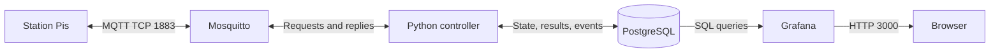
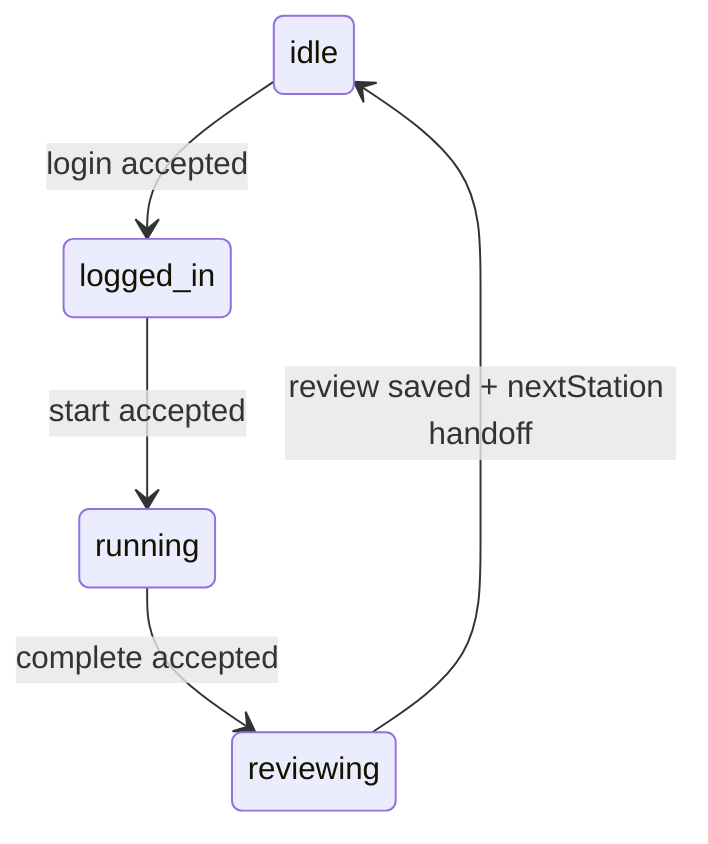
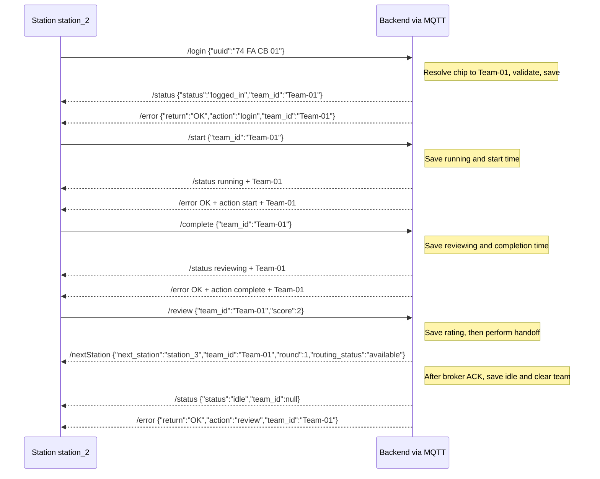
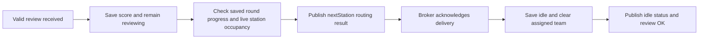
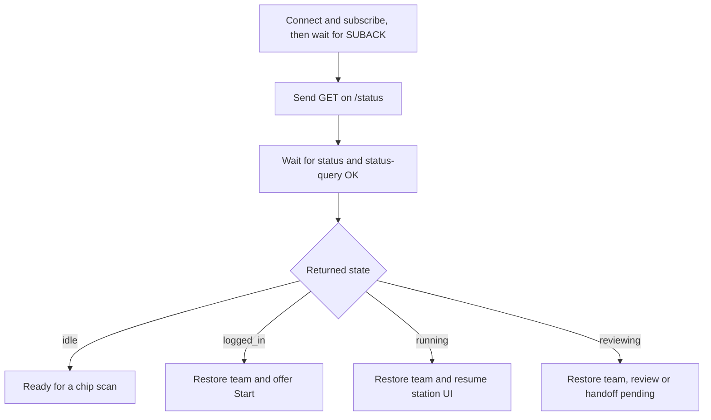
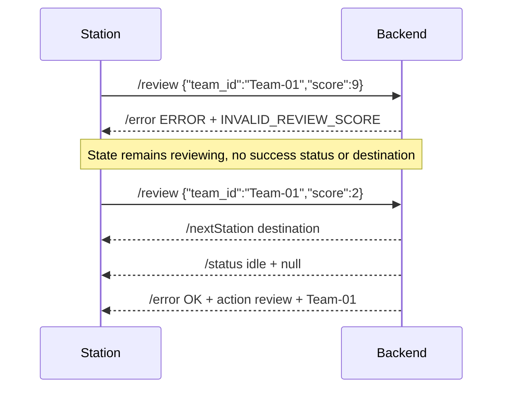

# Station MQTT guide

**Send an action → wait for its status and OK → continue.** The backend owns the
station state. All examples use `station_2`; replace it with your assigned ID.

[Connect](#1-connect) · [Send / receive](#2-what-to-send-and-receive) ·
[Full visit](#3-one-complete-visit) · [Next station](#4-automatic-next-station) ·
[Reconnect / errors](#5-reconnect-and-errors) · [Helpers](#6-time-and-connection-check) ·
[Test clients](#7-try-it) · [Backend / database / Grafana](docs/backend.md)

## System overview


```mermaid
flowchart LR
    S[Station Pis] <-->|MQTT TCP 1883| M[Mosquitto]
    M <-->|Requests and replies| B[Python controller]
    B <-->|State, results, events| D[(PostgreSQL)]
    D -->|SQL queries| G[Grafana]
    G -->|HTTP 3000| U[Browser]
```

The MQTT server is `MQTT-GNOM` at `192.168.1.11`. Stations use IDs and MQTT
usernames `station_2` (Morse), `station_3` (SQL), `station_4` (Password),
`station_5` (JavaHOH), and `station_6` (Quiz). See the
[station and IP setup tables](../README.md#ip-addresses-and-setup-status) for all
ESP/Pi addresses and which static IPs are confirmed.

## 1. Connect

### Stations

Use the station ID as the MQTT username and in `station/<station_id>/<topic>`.
The game name is the display name stored in the database.
The backend reads station IDs, names, and `routing_order` from the `station` table;
migration `0007` seeds the five entries below. There is no station list in `config.py`.

| Station ID / MQTT username | Game | Topic prefix |
| --- | --- | --- |
| `station_2` | Morse | `station/station_2/` |
| `station_3` | SQL | `station/station_3/` |
| `station_4` | Password | `station/station_4/` |
| `station_5` | JavaHOH | `station/station_5/` |
| `station_6` | Quiz | `station/station_6/` |

### IP addresses and setup status

The SQL, Password, and Quiz Pis below are confirmed to have static IPs configured.
Other station addresses are planned assignments; their setup is still unconfirmed.

| IP address | Station / service | Device | Hostname | Static IP setup |
| --- | --- | --- | --- | --- |
| `192.168.1.11` | MQTT broker | Server | `MQTT-GNOM` | Server address provided; static setup unconfirmed |
| `192.168.1.21` | `station_2` — Morse | ESP | Unknown | Unconfirmed |
| `192.168.1.22` | `station_2` — Morse | Pi | Unknown | Unconfirmed |
| `192.168.1.31` | `station_3` — SQL | ESP | Unknown | Unconfirmed |
| `192.168.1.32` | `station_3` — SQL | Pi | `Station-3-SQL` | Configured |
| `192.168.1.41` | `station_4` — Password | ESP | Unknown | Unconfirmed |
| `192.168.1.42` | `station_4` — Password | Pi | `station-4-password` | Configured |
| `192.168.1.51` | `station_5` — JavaHOH | ESP | Unknown | Unconfirmed |
| `192.168.1.52` | `station_5` — JavaHOH | Pi | Unknown | Unconfirmed |
| `192.168.1.61` | `station_6` — Quiz | ESP | Unknown | Unconfirmed |
| `192.168.1.62` | `station_6` — Quiz | Pi | `station-6-quiz` | Configured |

ESP and Pi at the same station share the station's MQTT username, but must use
different client IDs, e.g. `station_3-esp` and `station_3-pi`.
Device hostnames and game names are not MQTT usernames.

### Broker settings

| Setting | Value |
| --- | --- |
| Broker | `192.168.1.11:1883` on the project LAN; `localhost:1883` for local Docker |
| Protocol | MQTT 3.1.1 over TCP, without TLS |
| Username | Your station ID: `station_2` … `station_6` |
| Password | `testen123` in the supplied broker image |
| Client ID | Unique per connection, e.g. `station_2-game` |
| QoS / retain | QoS **1**, **`retain=false`** for requests and replies |
| Format | UTF-8 JSON; topic names and JSON fields are case-sensitive |

Subscribe to these **three topics**, wait for subscription confirmation (SUBACK),
then send requests:

```text
station/station_2/status
station/station_2/error
station/station_2/nextStation
```

Your username grants access only to your station's topics. Use `station_2`
exactly, including the underscore. A station Pi uses the server's LAN address;
`localhost` would connect to the station Pi itself.

## 2. What to send and receive

**Topic format:** `station/<station_id>/<topic>`.
Below, `/login` means the full topic **`station/station_2/login`**, and likewise
for every other suffix.

### Station → backend

| When | Topic | Exact example payload | Backend action / resulting state |
| --- | --- | --- | --- |
| Boot, reconnect, or check current state | `/status` | `{"request":"GET"}` | Read saved state; no game change |
| Team scans its chip while station is `idle` | `/login` | `{"uuid":"74 FA CB 01"}` | Resolve team, check availability → `logged_in` |
| Logged-in team starts playing | `/start` | `{"team_id":"Team-01"}` | Record start time → `running` |
| Game finishes | `/complete` | `{"team_id":"Team-01"}` | Record completion time → `reviewing` |
| Team submits its rating | `/review` | `{"team_id":"Team-01","score":2}` | Save rating → automatic next-station handoff → `idle` |

| Field | What goes here? |
| --- | --- |
| `uuid` | Scanned chip ID. Used **only for login**; maps from database `team.id` to `team.name`. |
| `team_id` | Resolved **team name** from the login reply, e.g. `Team-01`. Use it for start, complete, and review. |
| `score` | Integer **0, 1, or 2**. No strings, floats, or booleans. |

Chip IDs are strings: `74 FA CB 01` and `74FACB01` are different IDs. Use the
registered spelling. The station ID comes from the topic, not the JSON.

### Backend → station

| Topic | When it arrives | Example payload |
| --- | --- | --- |
| `/status` | Accepted login/start/complete, or status query | `{"status":"logged_in","team_id":"Team-01"}` |
| `/status` | Review handoff finished, or query of a free station | `{"status":"idle","team_id":null}` |
| `/error` | Request succeeded — **this topic also carries OK** | `{"return":"OK","action":"login","team_id":"Team-01"}` |
| `/error` | Request failed | `{"return":"ERROR","action":"review","team_id":"Team-01","error_code":"INVALID_REVIEW_SCORE","message":"Review score must be 0, 1, or 2."}` |
| `/nextStation` | Automatically after a saved review | `{"next_station":"station_3","team_id":"Team-01","round":1,"routing_status":"available"}` |

`status` is always `idle`, `logged_in`, `running`, or `reviewing`.
`action` identifies the request: `login`, `start`, `complete`, `review`, or `status`.
On errors, `team_id` may be `null` if the backend could not identify the team.
Stations **receive only** on `/error` and `/nextStation`; do not publish there.

### What must the station wait for?

| Request | Required successful replies |
| --- | --- |
| `login` / `start` / `complete` | Expected `/status` **and** matching `/error` with `return: "OK"` |
| `review` | `/nextStation` routing result (including a null destination) **and** `/status` with `idle` / null team **and** `/error` with review OK |
| Status query | Current `/status` **and** `/error` with `action: "status"`, `return: "OK"` |

Keep **one request outstanding per station**. Match replies by `action` and team;
for login, the team in status and OK must agree. Review OK and nextStation carry
the finishing team; the idle status carries `null`. Accept replies in any order
and tolerate duplicates. There are no request IDs to distinguish repeated attempts.

Status updates arrive **automatically** after actions. Do not send a GET after
every action. On the shared `/status` topic, ignore your echoed GET; process only
replies containing `status` and `team_id`.

## 3. One complete visit


```mermaid
stateDiagram-v2
    idle --> logged_in: login accepted
    logged_in --> running: start accepted
    running --> reviewing: complete accepted
    reviewing --> idle: review saved + nextStation handoff
```

The station stays occupied from accepted login through the completed handoff.
Each team can occupy only one station at a time. Logging in elsewhere returns
`TEAM_BUSY` until the previous station has finished its review handoff and returned
to `idle`. The rejected login changes no state, result, or event; retry after release.
Wrong-order actions, another login, and actions from another team are rejected.
**There are no automatic game/stage timeouts.**


```mermaid
sequenceDiagram
    participant S as Station station_2
    participant B as Backend via MQTT
    S->>B: /login {"uuid":"74 FA CB 01"}
    Note right of B: Resolve chip to Team-01, validate, save
    B-->>S: /status {"status":"logged_in","team_id":"Team-01"}
    B-->>S: /error {"return":"OK","action":"login","team_id":"Team-01"}
    S->>B: /start {"team_id":"Team-01"}
    Note right of B: Save running and start time
    B-->>S: /status running + Team-01
    B-->>S: /error OK + action start + Team-01
    S->>B: /complete {"team_id":"Team-01"}
    Note right of B: Save reviewing and completion time
    B-->>S: /status reviewing + Team-01
    B-->>S: /error OK + action complete + Team-01
    S->>B: /review {"team_id":"Team-01","score":2}
    Note right of B: Save rating, then perform handoff
    B-->>S: /nextStation {"next_station":"station_3","team_id":"Team-01","round":1,"routing_status":"available"}
    Note right of B: After broker ACK, save idle and clear team
    B-->>S: /status {"status":"idle","team_id":null}
    B-->>S: /error {"return":"OK","action":"review","team_id":"Team-01"}
```

Compact labels such as `running + Team-01` use the JSON shapes in the reply table.
Every successful action is saved before its confirmation is sent. A team can
complete each station once per game. After the final review handoff, its final
station becomes idle, but all results remain visible. When the same team next
logs into a free station, the backend clears that team's previous results and
starts a fresh game in the same transaction. Rejected logins do not clear results.
Events and station highscores remain saved.

## 4. Automatic next station

**`nextStation` is a message, not a state or a request.** It is sent to the
**current station's** topic, e.g. `station/station_2/nextStation`. The payload
names the destination or reports that the round is complete. It does not log
the team into the destination or reserve it.

### Routing payload

Subscribe to your own `/nextStation` topic before submitting the review. The
backend sends a **JSON object**, with QoS 1 and `retain=false`:

```json
{"next_station":"station_5","team_id":"Team-01","round":1,"routing_status":"available"}
```

| Field | Type | How to use it |
| --- | --- | --- |
| `next_station` | String or `null` | Destination station ID. Check for `null` before displaying directions. |
| `team_id` | String | Finishing team's name, as returned by login. Match it to the team being reviewed. |
| `round` | Integer | Event-history number for the finishing game; live state and results have no round column. |
| `routing_status` | String | Use the outcome table below to choose directions, a waiting notice, or a completion message. |

### Selection and handoff


```mermaid
flowchart LR
    R["Valid review received"] --> S["Save score and remain reviewing"]
    S --> D[Check saved round progress and live station occupancy]
    D --> N[Publish nextStation routing result]
    N --> A[Broker acknowledges delivery]
    A --> I["Save idle and clear assigned team"]
    I --> O[Publish idle status and review OK]
```

| Question | Current behavior |
| --- | --- |
| How is the destination chosen? | First free, unfinished station after the current number, wrapping station_6 → station_2. Completed stations in this team's round are skipped. |
| All remaining stations busy? | Send the team to the next unfinished, occupied station in that order, marked `queued`. Wait there until it becomes idle. |
| All five reviews done? | `next_station: null`, `routing_status: "round_complete"`. Show that the round is finished. A later login starts a new round. |
| Is the destination guaranteed free on arrival? | No reservation is made. `available` means idle when checked; another team may arrive first. Login still checks availability. |
| Must the station send a separate acknowledgement? | No. The backend waits for the MQTT **broker's** acknowledgement, not proof that the station displayed the destination. |
| When may the current station accept another team? | After confirmed `idle`; finish collecting the review replies first. |
| What should the station do with the destination? | Display it to the finishing team, including a waiting notice for `queued`. That team scans its chip at the destination when it is idle. |

| `routing_status` | `next_station` | Meaning |
| --- | --- | --- |
| `available` | Station name | Free and unfinished when checked |
| `queued` | Station name | Unfinished but currently occupied; go there and wait |
| `round_complete` | `null` | All configured stations reviewed in this round |
| `no_available_station` | `null` | No valid destination, e.g. missing station state or unfinished reviews elsewhere; contact the backend group |

`round` identifies the finishing game in event history. Every routing outcome still ends
with idle status and review OK after broker acknowledgement. A null destination
is a valid response, not a reason to resend the review. Routing can be recomputed
on controller reconnect while a handoff is pending, so a retried suggestion may change.

### Routing examples

All examples use five stations and the finishing team's **current round**.
The controller checks every eligible free station before falling back to a busy
one; it does not simply send the team to the next station number.

| Situation after review | Routing reply |
| --- | --- |
| Leaving station_2; station_3 is busy, station_4 was already completed, station_5 and station_6 are free and unfinished | `available`, `next_station: "station_5"` |
| Leaving station_5; station_6 was completed, station_2 is busy, station_3 is free and unfinished | `available`, `next_station: "station_3"` (wrap around) |
| Leaving station_2; only station_3 and station_5 are unfinished, and both are busy | `queued`, `next_station: "station_3"` |
| Every configured station has a completed game and a saved review | `round_complete`, `next_station: null` |
| All games were completed, but a review at another station is still missing | `no_available_station`, `next_station: null` (completed stations cannot be played again) |

For example, a finished round produces:

```json
{"next_station":null,"team_id":"Team-01","round":1,"routing_status":"round_complete"}
```

Show a completion message and finish collecting the idle status and review OK.
Do not automatically log the team into station_2: a later chip scan starts its
next round. For `no_available_station`, finish the same handoff and ask the backend
group to check missing reviews or station records. A status GET does not request
another routing decision.

For the database predicates and recovery details, see
[Choosing the next station in the backend guide](docs/backend.md#choosing-the-next-station).

## 5. Reconnect and errors

On boot or reconnect, subscribe first and query the saved state. **Do not assume
`idle` after restarting a Pi.** State lives in PostgreSQL.


```mermaid
flowchart TD
    C["Connect and subscribe, then wait for SUBACK"] --> Q["Send GET on /status"]
    Q --> W[Wait for status and status-query OK]
    W --> D{Returned state}
    D -->|idle| I[Ready for a chip scan]
    D -->|logged_in| L["Restore team and offer Start"]
    D -->|running| R["Restore team and resume station UI"]
    D -->|reviewing| V["Restore team, review or handoff pending"]
```

A `reviewing` status does not reveal whether a score is already saved. If a
review was sent but its outcome is unknown, do not assume it needs resubmitting.
The controller resumes saved handoffs on **controller** restart/MQTT reconnect.
A **station** reconnect only reads state; it does not trigger a handoff replay.


```mermaid
sequenceDiagram
    participant S as Station
    participant B as Backend
    S->>B: /review {"team_id":"Team-01","score":9}
    B-->>S: /error ERROR + INVALID_REVIEW_SCORE
    Note over S,B: State remains reviewing, no success status or destination
    S->>B: /review {"team_id":"Team-01","score":2}
    B-->>S: /nextStation destination
    B-->>S: /status idle + null
    B-->>S: /error OK + action review + Team-01
```

| Situation | Station response |
| --- | --- |
| Validation error | Keep current state; correct the request using `error_code` / `message`. |
| `HANDOFF_ERROR` | Review is already saved. Query status and contact the backend group if it stays pending; do not start another review. |
| No reply / connection lost | Outcome is unknown. Reconnect and query status before deciding to retry. Authentication/ACL failures may produce no backend reply. |
| Idle after reconnect, but destination was missed | GET does not replay the destination. Contact the backend group. |

<details>
<summary>Full error-code reference</summary>

| Code | Meaning |
| --- | --- |
| `INVALID_PAYLOAD` | Invalid JSON/UTF-8, non-object payload, or missing/non-string ID |
| `INVALID_TOPIC` | Topic is not `station/<station_id>/<action>` |
| `INVALID_ACTION` | Unsupported action; no station request to set idle directly |
| `INVALID_STATUS_REQUEST` | Query must be exactly `{"request":"GET"}` |
| `RETAINED_REQUEST` | Backend received a retained request |
| `INVALID_REVIEW_SCORE` | Score must be an integer 0, 1, or 2 |
| `UNKNOWN_TEAM` | Unknown chip ID or team |
| `STATION_BUSY` | Login at an occupied station |
| `TEAM_BUSY` | Team is still assigned to another station, including a pending review handoff |
| `INVALID_STATE` | Wrong action order, duplicate action, or review already saved |
| `TEAM_MISMATCH` | Requesting team does not own this station |
| `STATION_ALREADY_COMPLETED` | Team already completed this station in this round |
| `STATION_UNAVAILABLE` | Station is not configured or its database state is missing |
| `DATABASE_ERROR` | Database read/write failed |
| `HANDOFF_ERROR` | Review saved, but destination delivery or idle reset failed |

Validation failures leave game data unchanged. A handoff failure keeps the already
saved review. Errors are sent only on `/error`; there is no error station state.

</details>

## 6. Time and connection check

These helpers work independently of the game. Subscribe to the relevant topic
before sending; their replies use the **same topic** and produce no game status
or `/error` acknowledgement.

| Purpose | Topic suffix | Send | Receive |
| --- | --- | --- | --- |
| Server time | `/servertime` | `{"request":"GET"}` | `{"request":"POST","server_time":"2026-01-01T01:00:00+01:00","unix":1767225600}` (example) |
| Communication check | `/test` | Exactly `1` | Exactly `2` |

Time is ISO 8601 in **Europe/Berlin**, with the seasonal UTC offset. `unix` is
seconds since the Unix epoch. Ignore echoed GET messages; accept `request: "POST"`.
For `/test`, send the single character `1`, without quotes or whitespace, and
ignore its echo. A `2` confirms communication with that helper, not database readiness.

## 7. Try it

Install the client dependency, set `MQTT_HOST` at the top of the chosen script to
`192.168.1.11` (server Pi) or `localhost` (local Docker), then run from the repo root:

```sh
python -m pip install "paho-mqtt>=2.0"
```

| Command | Purpose |
| --- | --- |
| `python gameClient/clientStatus.py` | Query state without sending a game action |
| `python gameClient/clientLogin.py` | Send one login/start/complete/review; prompts for inputs |
| `python gameClient/clientServertime.py` | Read server time |
| `python gameClient/clientTest.py` | Send 1, wait for 2 |
| `python gameClient/clientAutoPlay.py` | Run three teams concurrently, then an extra Team-01 round and three live station states |

Migration `0008_team_tag_uids` registers these physical tags on fresh databases
and updates the existing teams when upgrading:

| Team | Tag UID (`team.id`) |
| --- | --- |
| Team-01 | `74 FA CB 01` |
| Team-02 | `35 7F CB 01` |
| Team-03 | `2C A1 19 49` |
| Team-04 | `63 12 46 16` |
| Team-05 | `F3 05 59 16` |

The action client waits for all required replies. Its default **5-second reply
wait** is a client timeout; it never resets the backend's game state.
Auto-play writes real results/events and stops on an error; use it when the
stations are free. The three teams play **concurrently**, starting at station_2,
station_3, and station_4. They follow the backend's routing; a lock per station
keeps simulated visitors from sending overlapping requests there. Run only one
auto-play process and avoid controlling the same stations externally during it.
Each `start` → `complete` takes a random **2–10 seconds** for realistic timing data.
Adjust `PLAY_SECONDS_MIN` / `PLAY_SECONDS_MAX` at the top of the script.
After all three teams finish, Team-01 plays its extra round.
After the full rounds, it starts three new visits and leaves:

| Station | Team | Final state |
| --- | --- | --- |
| `station_2` — Morse | Team-01 | `logged_in` |
| `station_3` — SQL | Team-02 | `running` |
| `station_4` — Password | Team-03 | `reviewing` (no rating submitted) |

These visits stay active after the script exits. Finish them using the action
client before rerunning auto-play. The running visit keeps accumulating elapsed
time until completed. Use `gameClient/` for this protocol.

Backend setup, team registration, database tables, and Grafana queries:
**[Backend operations guide](docs/backend.md)**.

## 8. Reset or unlock a station

Run these on the PC/Pi hosting the Docker stack, from this repository (use
`python3` on the Pi). Pause auto-play and station requests first.

```sh
# Unlock one station and remove its current result; preserve events/highscores.
python gameClient/resetGame.py --station station_3

# Delete ALL game results/events and return every station to idle, starting round 1.
python gameClient/resetGame.py --all
```

Both commands preserve highscores, team UIDs, station names/order, and Grafana configuration.
A single-station unlock also preserves events and adds a `reset` log entry.
The script stops the controller, applies the database changes in one transaction,
then starts the broker/controller and its helper services. Python packages run
inside the backend container; no host-side pip installation is needed.
Query `/status` before resuming station clients. See the
[recovery details](docs/backend.md#manual-reset-and-station-unlock).
