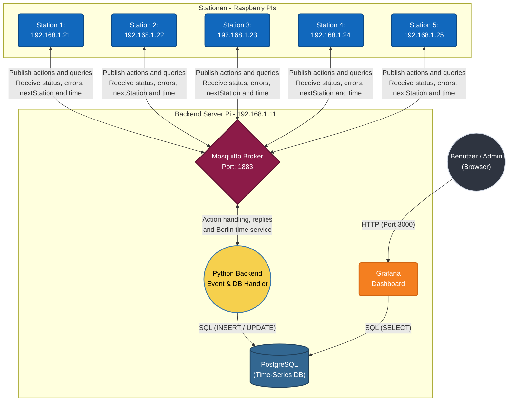
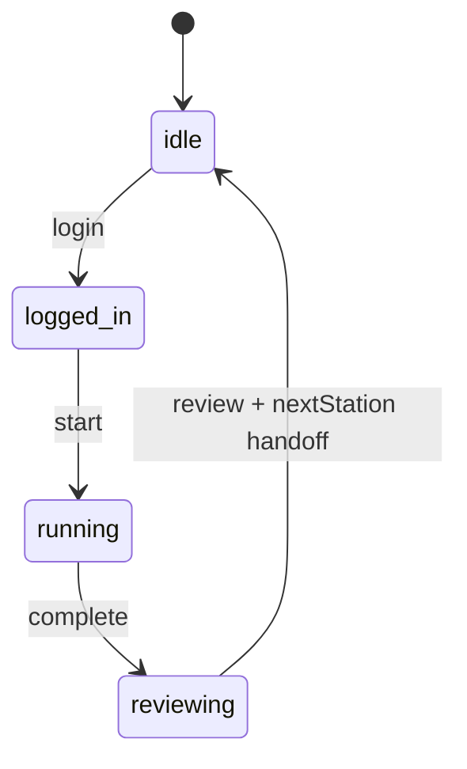
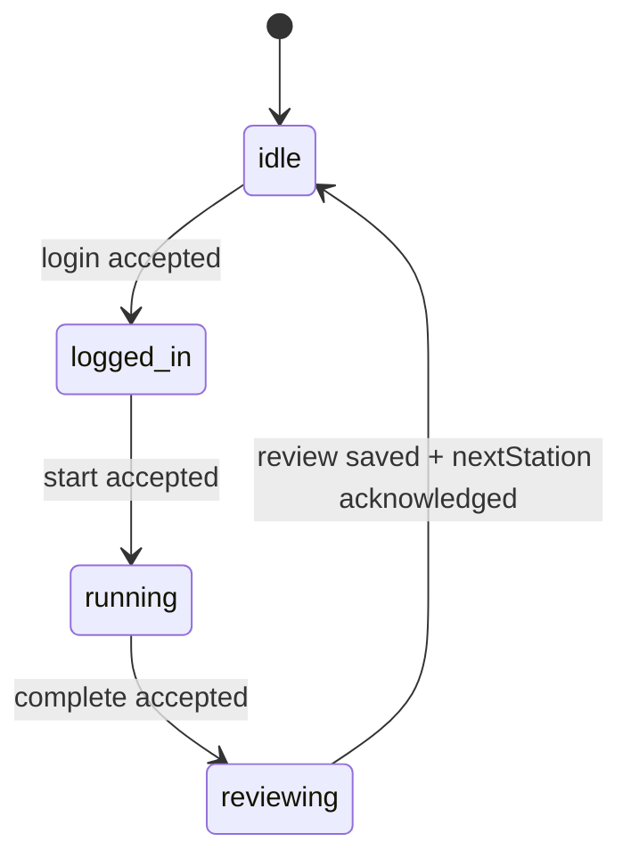

# Backend service
Backend for the school project

MQTT-Broker/Backend Server: **192.168.1.11:1883** <br>
Station 1 - xxxxxxxxxxxxxx: **192.168.1.21**<br>
Station 2 - xxxxxxxxxxxxxx: **192.168.1.22**<br>
Station 3 - xxxxxxxxxxxxxx: **192.168.1.23**<br>
Station 4 - xxxxxxxxxxxxxx: **192.168.1.24**<br>
Station 5 - xxxxxxxxxxxxxx: **192.168.1.25**<br>

Dashboard: Grafana<br>
Database: PostgreSQL (Time series database for grafana)<br>
Backend Service: Python (handles events & database handling)<br>
MQTT-broker: mosquitto

## Guide contents

- [Backend service](#backend-service)
  - [Guide contents](#guide-contents)
  - [MQTT integration guide for station groups](#mqtt-integration-guide-for-station-groups)
    - [1. Connect to the broker](#1-connect-to-the-broker)
      - [Identify devices in broker logs](#identify-devices-in-broker-logs)
    - [2. Topic reference](#2-topic-reference)
    - [3. Game actions and their required order](#3-game-actions-and-their-required-order)
    - [4. Status replies and read-only queries](#4-status-replies-and-read-only-queries)
    - [5. Example: one complete station visit](#5-example-one-complete-station-visit)
    - [6. Errors, timeouts, and reconnects](#6-errors-timeouts-and-reconnects)
      - [Example: correct a rejected review](#example-correct-a-rejected-review)
    - [7. Server time (Berlin time, included in the controller container)](#7-server-time-berlin-time-included-in-the-controller-container)
    - [8. Try the protocol with the supplied clients](#8-try-the-protocol-with-the-supplied-clients)
    - [9. Communication test](#9-communication-test)
- [Database schema](#database-schema)
    - [Current state, results, and events](#current-state-results-and-events)
- [grafana](#grafana)
  - [datasource setup](#datasource-setup)
- [Flowchart for one station](#flowchart-for-one-station)



```mermaid
flowchart TD
    %% Styling Definitionen
    classDef station fill:#1168bd,stroke:#0b4884,stroke-width:2px,color:#fff,rx:5px,ry:5px;
    classDef broker fill:#8c1b48,stroke:#5c102f,stroke-width:2px,color:#fff,rx:5px,ry:5px;
    classDef backend fill:#f6d04d,stroke:#3776ab,stroke-width:2px,color:#000,rx:5px,ry:5px;
    classDef database fill:#336791,stroke:#20405b,stroke-width:2px,color:#fff,rx:5px,ry:5px;
    classDef dashboard fill:#f47f20,stroke:#d16512,stroke-width:2px,color:#fff,rx:5px,ry:5px;
    classDef user fill:#2e3440,stroke:#d8dee9,stroke-width:2px,color:#fff,rx:20px,ry:20px;

    %% Externe Clients / Stationen
    subgraph Edge [Stationen - Raspberry PIs]
        direction LR
        S1["Station 1: <br/>192.168.1.21"]:::station
        S2["Station 2: <br/>192.168.1.22"]:::station
        S3["Station 3: <br/>192.168.1.23"]:::station
        S4["Station 4: <br/>192.168.1.24"]:::station
        S5["Station 5: <br/>192.168.1.25"]:::station
    end

    %% Zentraler Server
    subgraph Server [Backend Server Pi - 192.168.1.11]
        direction TB
        MQTT{"Mosquitto Broker<br/>Port: 1883"}:::broker
        PY(("Python Backend<br/>Event & DB Handler")):::backend
        DB[("PostgreSQL<br/>(Time-Series DB)")]:::database
        GF["Grafana<br/>Dashboard"]:::dashboard
    end

    Client(("Benutzer / Admin<br/>(Browser)")):::user

    %% Verbindungen (Exakte ursprüngliche Struktur)
    S1 & S2 & S3 & S4 & S5 <-- "Publish actions and queries<br/>Receive status, errors, nextStation and time" --> MQTT
    MQTT <-- "Action handling, replies<br/>and Berlin time service" --> PY
    PY -- "SQL (INSERT / UPDATE)" --> DB
    GF -- "SQL (SELECT)" --> DB
    Client -- "HTTP (Port 3000)" --> GF
```

# Topics

## MQTT integration guide for station groups

This section describes the station protocol, including the `nextStation`
handoff after review, the [broker permissions](mosquitto/config/mosquitto.acl), and
the separate [server-time script](gameController/servertime.py) and
[communication test service](gameController/communication_test.py). All examples use station 1.
Replace `station01` with your group's assigned station ID everywhere, including the MQTT username.

The next-station handoff and automatic reset to `idle` are implemented in
[gameController/gameLogic.py](gameController/gameLogic.py). The ACL permits the
backend to publish destinations, and the action test client waits for both the
idle status, review acknowledgement, and the JSON next-station message.

### 1. Connect to the broker

| Setting | Value |
| --- | --- |
| Broker on the server Pi | `192.168.1.11` |
| Broker on your own computer, including local Docker | `localhost` |
| Port / transport | `1883`, MQTT over TCP, without TLS |
| MQTT version used by the example clients | MQTT 3.1.1 |
| Username | Your station ID: `station01`, `station02`, ..., `station05` |
| Password in the supplied broker image | `testen123` |
| Client ID | A unique ID for each connected client, e.g. `station01-game` |
| Publish / subscribe QoS | Use `1` |
| Retain flag | Always publish requests with `retain=false` |

`localhost` means the machine running your client. A station Pi connecting to the
server Pi must use `192.168.1.11`, even if the station software itself runs locally.
The Docker service name `mosquitto` works inside the backend's Compose network.
The Compose stack exposes port 1883; its configured WebSocket listener on 9001 is
not published to other machines by the current Compose file.

The username determines topic permissions. For example, `station02` can publish
actions for `station/station02/...` and read its own replies. Use the exact spelling:
`station01`, not `station1`, `1`, or `station-01`. Stations do not need the `backend`
account or a subscription to `station/#`.

#### Identify devices in broker logs

The broker logs connection IPs, MQTT client IDs, usernames, and message topics.
Rebuild it to apply the logging configuration, then follow its output:

```sh
docker compose up -d --build mosquitto
docker compose logs -f mosquitto
```

For example (illustrative entries):

```text
2026-09-28T10:00:00+0000: New client connected from 192.168.1.21:53124 as station01-game (p4, c1, k60, u'station01').
2026-09-28T10:00:01+0000: Received PUBLISH from station01-game (d0, q1, r0, m1, 'station/station01/login', ... (26 bytes))
```

Match `station01-game` in the `Received PUBLISH` line to its connection entry to
find the sending IP (`192.168.1.21`). `Sending PUBLISH to ...` means the broker
is forwarding a message to a subscriber. The IP appears on the connection entry;
message entries identify the client and topic. Use the most recent connection
entry for that client ID. The supplied clients use automatically generated IDs,
which can be matched in the same way.

The IP is the network peer seen by Mosquitto. A Docker gateway, NAT, or proxy can
hide the device's original address. The controller receives MQTT topics and
payloads, not the publishing device's socket address. Logs also remain available
in `/mosquitto/log/mosquitto.log` inside the broker container. These options use
[Mosquitto's connection and packet logging](https://mosquitto.org/man/mosquitto-conf-5.html).

### 2. Topic reference

All game requests and responses are UTF-8 JSON objects, with QoS 1 and
`retain=false`. Subscribe to `/status` and `/error` before sending a request;
subscribe to `/nextStation` as well before reviewing. Wait for SUBACK first.

| Topic under `station/<station_id>/` | Request | Response |
| --- | --- | --- |
| `login` | `{"uuid":"AA BB CC 01"}` | `/status`: `logged_in`; `/error`: `OK` |
| `start` | `{"team_id":"Team-01"}` | `/status`: `running`; `/error`: `OK` |
| `complete` | `{"team_id":"Team-01"}` | `/status`: `reviewing`; `/error`: `OK` |
| `review` | `{"team_id":"Team-01","score":2}` | `/nextStation`: destination; after handoff `/status`: `idle`, `/error`: `OK` |
| `status` | `{"request":"GET"}` | Same topic: current state and team; `/error`: `OK` |
| `error` | No station request | Success/failure acknowledgement for each handled request |
| `nextStation` | No station request | `{"next_station":"station02","team_id":"Team-01"}` |
| `servertime` | `{"request":"GET"}` | Separate time-service response, documented below |
| `test` | JSON number `1` | Separate communication-test response: JSON number `2` |

Topic names and JSON fields are case-sensitive. The login UUID is resolved from
`team.id` to `team.name` in PostgreSQL on every login; subsequent actions use the team ID
from the login status response. `score` must be
an integer 0, 1, or 2; strings, floats, and booleans are rejected.

### 3. Game actions and their required order

There are exactly four station states. Topic/action names are transitions:

| Current state | Action | Next state |
| --- | --- | --- |
| `idle` | `login` | `logged_in` |
| `logged_in` | `start` | `running` |
| `running` | `complete` | `reviewing` |
| `reviewing` | `review` | `idle` after the next-station handoff |


```mermaid
stateDiagram-v2
    [*] --> idle
    idle --> logged_in: login
    logged_in --> running: start
    running --> reviewing: complete
    reviewing --> idle: review + nextStation handoff
```

An occupied station belongs to its assigned team until the handoff completes.
A duplicate or out-of-order action, a second login, or an action by the wrong
team receives an error without changing the database. A team cannot replay a
completed station in the same round. Once all configured stations are reviewed,
its next accepted login starts a new round; older results remain stored.

For review, the backend validates and commits the score/result/event first,
then sends the JSON destination. While awaiting the broker's acknowledgement,
the station remains `reviewing` with a saved score. After acknowledgement, it
commits `idle`, clears the current team/round/score, publishes the idle status,
and confirms review with `OK`. There is no separate `review` station state.
The next destination currently follows the temporary sequential rule
`station01 -> station02 -> ... -> station05 -> station01`.

### 4. Status replies and read-only queries

`/status` carries only the current station state and team:

```json
{"status":"logged_in","team_id":"Team-01"}
```

A successful review ends with:

```json
{"status":"idle","team_id":null}
```

Send `{"request":"GET"}` on the same topic at any time to read committed
state without changing the game or adding an event. The controller ignores its
own status responses. No error state is ever published on `/status`.

Despite its name, `/error` is the acknowledgement topic for **both outcomes**:

```json
{"return":"OK","action":"login","team_id":"Team-01"}
```

```json
{
  "return":"ERROR",
  "action":"review",
  "team_id":"Team-01",
  "error_code":"INVALID_REVIEW_SCORE",
  "message":"Review score must be 0, 1, or 2."
}
```

Successful game acknowledgements follow the database commit; review OK follows
both the saved review and committed idle reset. Status queries also receive OK.
The acknowledgement's team identifies the requester (null when unknown).
For review OK it is the finishing team, while the idle status has `team_id: null`.
Controller outputs on `/error` and `/nextStation` are ignored by the request
handler, preventing reply loops.

### 5. Example: one complete station visit

```mermaid
sequenceDiagram
    participant S as Station station01
    participant B as Backend
    participant D as PostgreSQL
    S->>B: /status {"request":"GET"}
    B->>D: Read current station state
    B-->>S: /status {"status":"idle","team_id":null}
    B-->>S: /error OK + action status
    S->>B: /login {"uuid":"AA BB CC 01"}
    B->>D: Commit logged_in, result, login event
    B-->>S: /status {"status":"logged_in","team_id":"Team-01"}
    B-->>S: /error {"return":"OK","action":"login","team_id":"Team-01"}
    S->>B: /start {"team_id":"Team-01"}
    B->>D: Commit running, started_at, start event
    B-->>S: /status running + Team-01
    B-->>S: /error OK + action start
    S->>B: /complete {"team_id":"Team-01"}
    B->>D: Commit reviewing, completed_at, complete event
    B-->>S: /status reviewing + Team-01
    B-->>S: /error OK + action complete
    S->>B: /review {"team_id":"Team-01","score":2}
    B->>D: Commit score, result, review event
    B-->>S: /nextStation {"next_station":"station02","team_id":"Team-01"}
    Note over B: Wait for broker acknowledgement
    B->>D: Commit idle and idle event; clear occupancy
    B-->>S: /status {"status":"idle","team_id":null}
    B-->>S: /error {"return":"OK","action":"review","team_id":"Team-01"}
```

Send one request at a time per station; replies have no request IDs. Match the
acknowledgement's `action` and `team_id` to your pending request. For login,
the resolved team in the status and OK must agree. Review OK identifies the
finishing team, while idle status has a null team. Accept responses in either
arrival order; a status message alone is not an action acknowledgement. Without
request IDs, replies cannot distinguish separate attempts by the same team.

This follows the left-hand sequence in the state-machine drawing: optional GET,
login UUID, logged_in, start, running, complete, reviewing, review score,
nextStation, then idle with no team. `/error` adds the OK/error acknowledgements.
The destination handoff confirms broker receipt, not processing by the station.
There are no automatic game/stage timeouts.

### 6. Errors, timeouts, and reconnects

Every rejected routable game request receives `return: ERROR` on `/error` with
`action`, `team_id`, `error_code`, and `message`. Validation failures leave state,
results, and events unchanged; database failures roll back the transaction.
For example, an invalid review leaves the station `reviewing`, allowing a
corrected score. Errors never become station states or history events.

| Code | Meaning |
| --- | --- |
| `INVALID_PAYLOAD` | Malformed JSON/UTF-8, non-object payload, or missing/non-string identifier |
| `INVALID_TOPIC` | Not exactly `station/<station_id>/<action>` |
| `INVALID_ACTION` | Unsupported transition; stations cannot publish an idle transition |
| `INVALID_STATUS_REQUEST` | Status query is not exactly `{"request":"GET"}` |
| `RETAINED_REQUEST` | Controller received the request with its retained flag set |
| `INVALID_REVIEW_SCORE` | `score` is not an integer 0, 1, or 2 |
| `UNKNOWN_TEAM` | UUID is unmapped or team does not exist |
| `STATION_BUSY` | Login attempted at an occupied station |
| `INVALID_STATE` | Wrong action order, duplicate action, or review already saved |
| `TEAM_MISMATCH` | Requesting team does not own the station |
| `STATION_ALREADY_COMPLETED` | This team already completed the station in this round |
| `STATION_UNAVAILABLE` | Station is unconfigured or has no database state |
| `DATABASE_ERROR` | Reading or committing a request failed |
| `HANDOFF_ERROR` | Review was saved, but publishing the destination or committing idle failed |

A handoff failure does not undo the already saved review. The station remains
`reviewing` and the controller retries the pending destination after restart or
MQTT reconnect. A completed game awaiting its first review also has state
`reviewing`, but no saved score; it is never released automatically on restart.
Review/destination acknowledgements can therefore be delivered more than once.
Broker acknowledgement does not mean the Pi has processed the destination.
If the final destination is missed after the station is idle, a status query
cannot replay it; contact the backend group rather than submitting review again.

Timeouts remain possible if the controller or broker is unavailable. Query status
before retrying an uncertain action. A rejected topic needs a safe reply address
(1–50 letters, digits, underscores, or hyphens in the station ID); otherwise the
controller logs it without replying. ACL/authentication failures cannot be
acknowledged by a controller that never receives the request.

#### Example: correct a rejected review

At `reviewing`, send `{"team_id":"Team-01","score":9}` on `/review`.
The backend replies with `INVALID_REVIEW_SCORE` on `/error` and keeps the state.
Resubmit with `score: 2`; expect the JSON destination, idle status, and review OK.
The supplied action client validates scores before publishing, so use a direct
MQTT publisher to deliberately send invalid scores.

### 7. Server time (Berlin time, included in the controller container)

The separate [gameController/servertime.py](gameController/servertime.py) script
starts automatically alongside the game controller in the **same container**.
It uses its own MQTT connection and network thread, with client ID
`<MQTT_CLIENT_ID>_servertime`, and shares the controller's broker settings and
credentials. No extra Compose service is needed. Rebuild to apply the change:

```sh
docker compose up -d --build mosquitto game-controller
```

For standalone local use, set `MQTT_HOST` to the broker's address in your environment
(default: `127.0.0.1`) and run the script with Python 3.9+:

```sh
python -m pip install paho-mqtt==2.1.0 tzdata
python gameController/servertime.py
```

Run only one time responder for a broker. The old
`mqtt-test/servertime/servertime.py` is a legacy UTC example; do not run it alongside
this service, or clients will receive replies from both.

Subscribe to `station/station01/servertime`, wait for SUBACK, and publish this JSON
object to the same topic with QoS 1 and `retain=false`:

```json
{"request":"GET"}
```

The service replies on that same topic with JSON in this form (example timestamp):

```json
{"request":"POST","server_time":"2026-01-01T01:00:00+01:00","unix":1767225600}
```

`server_time` is an ISO 8601 timestamp in **Europe/Berlin**, including its UTC
offset: `+01:00` in winter (CET), `+02:00` in summer (CEST). The offset changes
automatically using Python's [zoneinfo](https://docs.python.org/3/library/zoneinfo.html)
timezone data, which is included in the container. `unix` is seconds since the
Unix epoch and represents the same instant; it does not receive a timezone offset.
The service reads the server's system clock, so the server/Pi clock must be correct.
Ignore your echoed `GET` request and only process objects with `request: "POST"`.
Time queries do not change game state and do not produce a reply on `/status`.
Time queries use `{"request":"GET"}` and receive `request: "POST"`.
Game status queries use `{"request":"GET"}` and receive `status`/`team_id`
plus a separate acknowledgement on `/error`.
Malformed messages, retained requests, and echoed replies are ignored. Replies
use QoS 1 and `retain=false` and are sent only to the requesting topic. A server
client can also request time if its MQTT credentials allow access to that topic;
station clients should use their own assigned station topic as usual.

### 8. Try the protocol with the supplied clients

The game clients provide working examples of subscribing before publishing,
formatting action payloads, filtering replies, and waiting for a response.
From the repository root, install their dependency:

```sh
python -m pip install paho-mqtt==2.1.0
```

Set `MQTT_HOST` near the top of [clientStatus.py](gameClient/clientStatus.py),
[clientLogin.py](gameClient/clientLogin.py), [clientServertime.py](gameClient/clientServertime.py),
or [clientTest.py](gameClient/clientTest.py)
to `"192.168.1.11"` for the server Pi,
or `"localhost"` for a broker on your own machine. Then run:

```sh
# Read current state; enter your station ID when prompted.
python gameClient/clientStatus.py

# Send one action; login asks for a UUID, later actions for a team ID (and review score).
python gameClient/clientLogin.py

# Request the server's Berlin timestamp; enter your station ID when prompted.
python gameClient/clientServertime.py

# Send plain 1 and wait for plain 2; enter your station ID when prompted.
python gameClient/clientTest.py

# Automatically play three teams, then an extra round with Team-01; no prompts.
python gameClient/clientAutoPlay.py
```

The [auto-play client](gameClient/clientAutoPlay.py) runs Team-01, Team-02, and
Team-03 one after another. Each starts at station01 and sends `login`, `start`,
`complete`, and `review` at all five stations, following the backend's
`nextStation` replies. It waits for `idle` before login and after every handoff,
then plays another full round with Team-01. On a fresh database, this gives
Team-01 rounds 1 and 2, and Team-02 and Team-03 round 1 each.
Edit `MQTT_HOST`, `TEAMS` (team names, registered UUIDs, and review scores),
`STATION_COUNT`, and `PLAY_SECONDS` at the top of this script. The default play
delay is zero so it quickly fills the database with **20 results and 100 events**
(four full rounds, five stations, five events per visit including `idle`). It uses
review scores 0, 1, and 2 for the three teams. Increase `PLAY_SECONDS` for longer
recorded playing times. It uses the existing action and status clients with
these settings.

Run it with the controller and broker available and these teams ready to start
a round. It creates real game results and events. With round tracking enabled,
running it again after a successful run adds two more rounds for Team-01 and one
more round each for Team-02 and Team-03. Round numbers continue from saved history.
An error or timeout stops the script with exit code 1; it does not reset or resume
an unfinished round. A busy station is polled for up to 30 seconds (plus any
in-flight status request). Avoid operating the same station from another client
during the simulation because replies have no request IDs.

Run the action client once per step in the example visit. Its default NFC UUID is
`AA BB CC 01`; use a UUID registered by the backend group for real hardware.
For `review`, the action client subscribes to `/status`, `/error`, and
`/nextStation` before publishing. It waits for idle status, review OK, and the
JSON destination in any order. Other actions wait for their target status and
OK. Error replies stop the wait immediately. `clientStatus.py` independently
requests current state and waits for the status reply and status-query OK.

After changing controller code or the ACL, rebuild the two services on the backend host:

```sh
docker compose up -d --build mosquitto game-controller
```

The [server-time client](gameClient/clientServertime.py) subscribes before sending
`{"request":"GET"}`, ignores its echoed request and retained messages, then prints
the server's Berlin timestamp and Unix timestamp and disconnects. It waits up to
five seconds for a reply (`RESPONSE_TIMEOUT`) and exits with code 1 on failure.
Example output:

```text
[BERLIN TIME] 2026-01-01T01:00:00+01:00
[UNIX] 1767225600
```

The older [mqtt-test/main.py](mqtt-test/main.py) and [mqtt-test/test_pub.py](mqtt-test/test_pub.py)
use a different JSON action format. Their `backend/timestamp` routing topic and
JSON `next_station` messages are different from the new station-specific
`station/<station_id>/nextStation` topic and its JSON payload. Use the topics
and JSON action payloads documented above for new station implementations.

### 9. Communication test

Use `station/<station_id>/test` for a simple communication check. For station 1:

1. Subscribe to `station/station01/test` and wait for SUBACK.
2. Publish exactly `1` to that same topic, with QoS 1 and `retain=false`.
3. Wait for exactly `2` on the same topic. Ignore your own echoed `1`.

These payloads are single UTF-8 characters (bytes `0x31` and `0x32`), without
quotes, whitespace, JSON objects, or additional fields. The service only answers
`1` with `2`; it ignores `2` and other payloads, so replies cannot create a loop.
Always send non-retained requests. Stored retained requests delivered when the
service subscribes are ignored.

The separate [communication_test.py](gameController/communication_test.py) script
starts automatically in the game-controller container, like the time service.
It uses its own MQTT connection with client ID `<MQTT_CLIENT_ID>_communication_test`
and the controller's broker settings. It does not call game logic, access the
database, change station state, or send `/status` messages. A reply confirms
communication with this service; it does not check database or game readiness.

The [test client](gameClient/clientTest.py) prints `2` and exits with code 0 after
a reply. It ignores its echoed `1` and retained messages, and exits with code 1
on failure or after `RESPONSE_TIMEOUT` seconds without a reply (default: 5).
Run one test at a time per station because replies contain no request ID.

To apply the service and its broker permissions:

```sh
docker compose up -d --build mosquitto game-controller
```

For standalone use, set the `MQTT_HOST` environment variable to your broker
(default: `127.0.0.1`) and run `python gameController/communication_test.py`.
Run only one responder per broker; the container already starts one.

# Database schema

`gameController/gameLogic.py` owns action validation, transition rules, team
checks, result/timing decisions, and handoff handling. `db.py` only handles
database queries, writes, and transactions. The logic runs its checks while the
database transaction holds the station row lock, so competing requests cannot
invalidate a check before the corresponding writes commit. `main.py` starts
game initialization, the controller MQTT client, and separate network threads
for the server-time and communication test services.

Alembic revision `0002_station_state` defines persistent station state and a
separate event history for Grafana. The controller reads and updates these tables
directly, with no in-memory station-state cache. Revision `0003_result_timing`
provides `started_at` and `completed_at`; the controller records these timestamps
on accepted start and complete actions. Revision `0004_team_rounds` adds `round`
to events, results, and occupied station state. Existing records become round 1;
existing idle stations keep a null round. Apply this migration to an existing
database without deleting its volume.
Revision `0005_station_states` converts station states without deleting data:
`login -> logged_in`, `start -> running`, and `complete/review -> reviewing`.
Existing saved review scores distinguish pending handoffs from teams still
entering a review. Downgrading this revision restores the old state names.
Revision `0006_team_identifiers` uses `team.id` for the scanned chip ID and
`team.name` for the unique team name. It converts existing game references to
team names and seeds the five former config mappings once, without an extra column. Migrations `0001`
through `0004` already on main remain unchanged.
`results.status` continues to record the latest accepted action (`login`, `start`,
`complete`, `review`), as does `station_events.event_type`; these are not the
station's live state.
Chip IDs (`team.id`) and station IDs are `VARCHAR(50)` strings. Unique team
names (`team.name`) and game-table `team_id` columns are `VARCHAR(255)` strings;
for example, `AA BB CC 01` maps to `Team-01`. `station_state` uses
`team_id` for the assigned team. Only the event row counter (`station_events.id`)
identifies an event. The new `round` column is a positive integer scoped to a team,
not a globally shared round counter.
The older revisions originally targeted a fresh string-ID schema. Upgrade from
the current main schema with `alembic upgrade head`; no volume reset is needed
for the new station states.

| Table | Purpose |
| --- | --- |
| `team` | Unique, non-null primary key `id` for the scanned chip (e.g. `AA BB CC 01`) and unique, non-null `name` (e.g. `Team-01`). |
| `station` | String primary key `station_id` such as `station01`, plus its name. |
| `station_state` | One current-state row per station: `status`, `team_id`, `round`, `review_score`, and `updated_at`. Idle stations have no team or round. |
| `results` | One result per team/round/station: `started_at`, `completed_at`, review, and result status. Earlier rounds remain available. |
| `station_events` | Event history for Grafana: timestamp, station username (e.g. `station01`), team name, `round`, event type, and optional review score. Existing rows are preserved. |

PostgreSQL is the source of truth for teams and their scanned identifiers.
The resolved team name is used consistently in `team.name`,
`results.team_id`, `station_state.team_id`, and `station_events.team_id`.
The station string is used consistently in every `station_id` column.
Startup initializes station names from their IDs but never creates or overwrites
teams. The migration seeds `AA BB CC 01` through `AA BB CC 05` for `Team-01`
through `Team-05`. Manage teams directly in PostgreSQL, for example:

```sql
-- Replace a chip without changing its team's identity or saved results.
UPDATE team SET id = 'AA BB CC 06' WHERE name = 'Team-01';

-- Register another team with any non-empty string identifier.
INSERT INTO team (id, name)
VALUES ('another-chip-format', 'Team-06');
```

Changes apply on the next login without a controller restart. Identifiers are
case-sensitive strings, not parsed hex bytes or a PostgreSQL UUID type. Internal
spaces are significant (`AA BB CC 01` differs from `AABBCC01`); surrounding request
whitespace is stripped, so store identifiers without leading/trailing whitespace.
Both `id` and `name` must be unique and non-null. The JSON login field remains
`uuid` for compatibility. Only `team.id` stores the scanned chip ID. The existing
`team_id` fields in MQTT replies, states, results, and Grafana events contain the
team **name**. Results and station state reference `team.name` with foreign keys;
renaming a team updates these references automatically. Event names stay as
historical snapshots. Grafana joins game records to `team.name`, not the chip ID.

`station_state` accepts only `idle`, `logged_in`, `running`, and `reviewing`.
An idle station has no team; every other state requires a known team name.
Only `reviewing` may have a saved score (0, 1, or 2) while its handoff is pending.
No next-station destination is stored in this table. The planned routing logic will choose a free station when the team
finishes; the current controller still uses the temporary sequential routing rule.
State transitions and acknowledgement handling remain controller responsibilities.
The controller locks the station and team rows, checks the action against the current
state, and writes state, result, and event in one transaction. The team lock also
serializes round decisions when requests arrive at different stations. It refreshes
`updated_at` on each state change and sends a success reply only after commit.
Failed writes roll back together; duplicate or out-of-order actions add no event.

### Current state, results, and events

`station_state` is the live snapshot: **what is happening at this station now?**
Its single row for a station is updated as that station moves through the game.
For example, station01 can show `status = running` and `team_id = Team-01`.
After the next-station handoff, that same row becomes `idle`, with no team
or review score, and with `round = NULL`. It does not keep previous visits.

`results` describes **how a particular team did at a particular station in one round**.
`started_at` is set when `start` is accepted, and `completed_at` when `complete`
is accepted. Both are timezone-aware timestamps. Login waiting time and review
time are excluded. Before starting, both are null; during play, only `started_at`
is filled. A completion requires a start and cannot precede it. No separate
duration column is needed: duration is `completed_at - started_at`.
The primary key is `(team_id, round, station_id)`. Before accepting
login, the controller checks that round's result under the station and team locks.
A result with `completed_at` set, or status `complete`/`review`, blocks another visit
by the same team in that round. Only a missing or unfinished result can be initialized on login.
Rejected repeat visits do not change any state, result, or event rows.

The controller reads the team's latest round from its saved results. When every
configured station has a completed result with status `review`, the next accepted
login creates a result in `round + 1`. The increment and login are one transaction,
so a rejected or failed login cannot advance the round. Restarting the controller
preserves this history. One team's new round does not advance another team's round.

For example, Team-01's first five visits generate round-1 events. After the final
review, the next login at station01 generates a round-2 event and a separate
round-2 result. All subsequent transitions for that visit use round 2. An old
handoff acknowledgement still logs `idle` under its original visit's round, even
if the team has already started its next round at another station.

`station_events` is the chronological history: **what changed, and when?**
Each accepted transition adds a new row instead of replacing the previous one.
For example, Team-01 can have `login` at 14:00, `start` at 14:01, `complete` at
14:04, and later `review` and `idle` events. The result retains the three-minute
playing time even after the live station state is reset. An `idle` event keeps
the finishing team's name and round for history; the live idle state has neither.

The controller performs these writes:

| Accepted transition | `station_state` | `results` | `station_events` |
| --- | --- | --- | --- |
| `login` | Set team, round, and `logged_in`. | Start a new round if all stations were reviewed; otherwise reject a replay in this round. Create or reset its unfinished result. | Append `login` with the accepted round. |
| `start` | Set `running`. | Set `started_at` and result status. | Append `start`. |
| `complete` | Set `reviewing`. | Set `completed_at` and result status. | Append `complete`. |
| `review` | Keep `reviewing` and save score until handoff. | Save review and result status. | Append `review` with score. |
| Handoff acknowledged | Set `idle` and clear team, round, and score. | Keep the finished result and its times. | Append `idle` with the finishing team's round. |

Each transition uses the same database timestamp for its state, result, and
event writes. A status query only reads committed state and does not create an
event. MQTT message IDs are kept locally to match acknowledgements to reviews;
they are not the game state. An acknowledgement for an older review cannot
release a newer visit. On reconnect, pending handoffs are found in the database.
If PostgreSQL is unavailable, requests receive an error rather than an invented
idle state; a failed handoff release stays in `reviewing` until a reconnect retries it.

At startup, the controller adds station names from `STATION_COUNT` and missing
idle state rows. Existing occupied states, results, and database-managed team
mappings are preserved. Old event history is not used to guess
state for a database that predates the state table. Existing team names must be
unique before applying this migration.
Existing result timestamps must also satisfy the timing rule before applying
`0003_result_timing`; inconsistent records are not silently rewritten.

Apply migrations before starting the updated controller (PostgreSQL must be running):

```sh
docker compose stop game-controller
docker compose build backend
docker compose run --rm --no-deps backend true
docker compose up -d --build mosquitto game-controller
```

The `backend` service runs `alembic upgrade head` once and exits successfully.
Compose waits for that success before starting `game-controller`. Both Alembic
and the controller use the database settings in `gameController/config.py`,
overridden by `DB_HOST`, `DB_PORT`, `DB_NAME`, `DB_USER`, and `DB_PASSWORD`.
Compose supplies the same PostgreSQL credentials to both services.

Start or update the stack with `docker compose up -d --build`. For local
execution, install `requirements.txt` and `tzdata` (needed where system timezone
data is absent), run `alembic upgrade head` from the project root, then run
`python gameController/main.py` with the same DB environment.
The controller no longer creates or changes tables itself.
The migration removes any old `team.signature` values. A downgrade recreates an
empty signature column and drops `station_state`, but deliberately keeps the
event history because the current controller still uses it.
Downgrading `0004_team_rounds` is refused once round-2 or later records exist,
because the old schema cannot keep multiple rounds of results.

For a Grafana table panel showing the event history:

```sql
SELECT created_at AS "time", station_id, team_id AS team_name,
       "round", event_type AS action, review_score
FROM station_events
WHERE $__timeFilter(created_at)
ORDER BY created_at DESC, id DESC;
```

For a Grafana table panel showing completed playing times per team and station:

```sql
SELECT r.completed_at AS "time", t.name AS team_name, s.name AS station_name,
       r."round", r.started_at, r.completed_at,
       EXTRACT(EPOCH FROM (r.completed_at - r.started_at)) AS duration_seconds
FROM results AS r
JOIN team AS t ON t.name = r.team_id
JOIN station AS s ON s.station_id = r.station_id
WHERE r.completed_at IS NOT NULL AND $__timeFilter(r.completed_at)
ORDER BY r.completed_at DESC, t.name, s.name;
```

Set the `duration_seconds` field unit to seconds in Grafana. The panel shows
results as soon as the controller accepts a complete action.

For a table panel showing the current station state:

```sql
SELECT s.name AS station, ss.team_id, ss.status, ss.review_score, ss.updated_at
FROM station_state AS ss
JOIN station AS s ON s.station_id = ss.station_id
ORDER BY s.station_id;
```

Enable the dashboard refresh interval to show new events and current states.
Do not time-filter the current-state panel: an occupied station must remain
visible even when its last change happened outside the dashboard time range.

# grafana

## datasource setup
- Grafana website -> http://localhost:3000/ <br>
- Connections -> Add new Datasource <br>
```
Host URL:   'postgres:5432'
DB name:    'stations'
Username:   'stationuser'
Password:   'changeme'
TLS/SSL:     disable
```
<br>
After that import the test dashboard (or any other from us) <br>
(you may have to click on every panel and click 'run query' once for it to show default data) <br>

# Flowchart for one station


```mermaid
stateDiagram-v2
    [*] --> idle
    idle --> logged_in: login accepted
    logged_in --> running: start accepted
    running --> reviewing: complete accepted
    reviewing --> idle: review saved + nextStation acknowledged
```

Each successful transition publishes the current state on `/status` and JSON
`return: OK` on `/error`. Rejected requests publish JSON `return: ERROR` on
`/error` and preserve the station's state. Review success is confirmed after
the handoff completes and the idle state has been committed.
