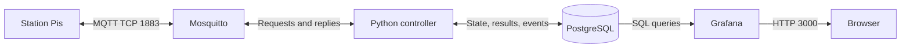
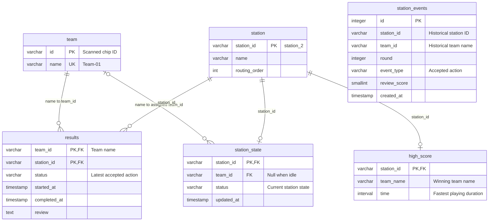
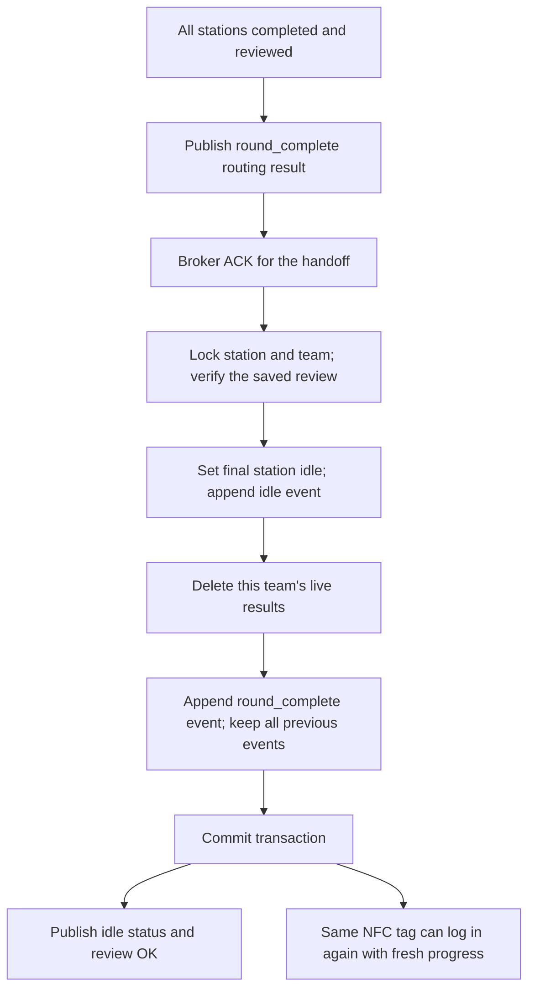
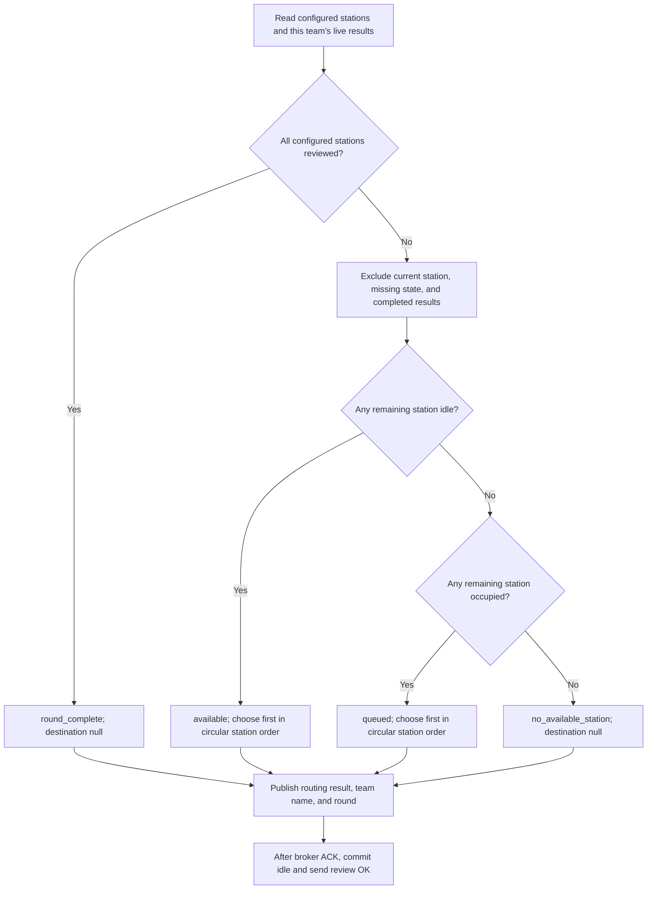
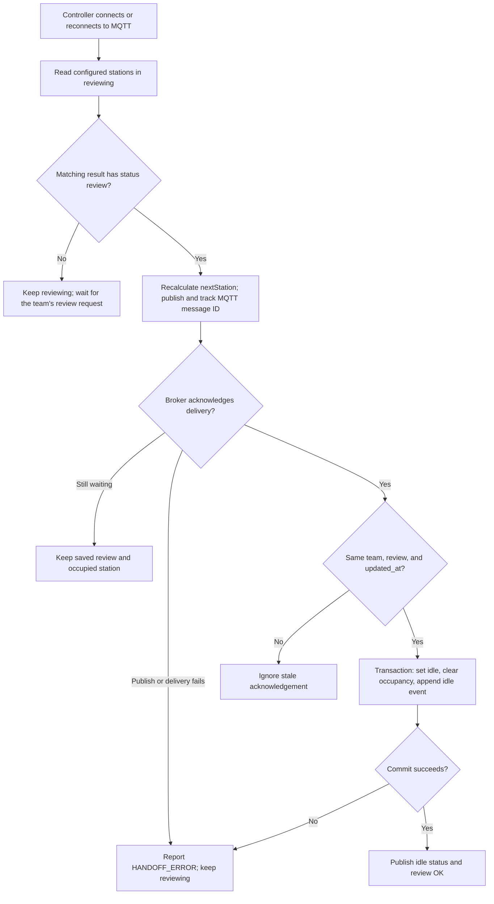

# Backend operations and database

[Back to the station MQTT guide](../README.md)

For station integration, use the README. This page covers deployment, stored
state, team registration, next-station routing, and Grafana queries.

## System overview



The MQTT server is `MQTT-GNOM` at `192.168.1.11`. Stations use IDs and MQTT
usernames `station_2` (Morse), `station_3` (SQL), `station_4` (Password),
`station_5` (JavaHOH), and `station_6` (Quiz). See the
[station and IP setup tables](../README.md#ip-addresses-and-setup-status) for all
ESP/Pi addresses and which static IPs are confirmed.

## Database schema


`gameController/gameLogic.py` owns action validation, transition rules, team
checks, result/timing decisions, and handoff handling. `db.py` only handles
database queries, writes, and transactions. The logic runs its checks while the
database transaction holds the station row lock, so competing requests cannot
invalidate a check before the corresponding writes commit. `main.py` starts
game initialization, the controller MQTT client, and separate network threads
for the server-time and communication test services.

Alembic revision `0002_station_state` defines persistent station state and a
separate event history for Grafana. The controller reads and updates these tables
directly, with no in-memory station-state cache. Revision `0003_result_timing`
provides `started_at` and `completed_at`; the controller records these timestamps
on accepted start and complete actions. Revision `0004_team_rounds` adds `round`
to events, results, and occupied station state. Existing records become round 1;
existing idle stations keep a null round. Revision `0009_high_score` later removes
rounds from the two live tables; `station_events.round` remains for history.
Revision `0005_station_states` converts station states without deleting data:
`login -> logged_in`, `start -> running`, and `complete/review -> reviewing`.
At that revision, saved state scores distinguished pending handoffs. Revision
`0010_remove_state_review` removes that field; the controller now checks
`results.status = 'review'` to identify an accepted review. Downgrading this revision restores the old state names.
Revision `0006_team_identifiers` uses `team.id` for the scanned chip ID and
`team.name` for the unique team name. It converts existing game references to
team names and seeds the five former config mappings once, without an extra column. Migrations `0001`
through `0008` already on main remain unchanged.
`results.status` continues to record the latest accepted action (`login`, `start`,
`complete`, `review`), as does `station_events.event_type`; these are not the
station's live state.
Chip IDs (`team.id`) and station IDs are `VARCHAR(50)` strings. Unique team
names (`team.name`) and game-table `team_id` columns are `VARCHAR(255)` strings;
for example, `74 FA CB 01` maps to `Team-01`. `station_state` uses
`team_id` for the assigned team. Only the event row counter (`station_events.id`)
identifies an event. Only `station_events` now stores a `round` column. It is a positive history
number scoped to a team, not part of live station state or result keys.
The older revisions originally targeted a fresh string-ID schema. Upgrade from
the current main schema with `alembic upgrade head`; no volume reset is needed
for the new station states.

| Table | Purpose |
| --- | --- |
| `team` | Unique, non-null primary key `id` for the scanned chip (e.g. `74 FA CB 01`) and unique, non-null `name` (e.g. `Team-01`). |
| `station` | String primary key `station_id` such as `station_2`, game `name`, and positive integer `routing_order`. |
| `station_state` | One live row per station: `status`, `team_id`, and `updated_at`. Idle stations have no team. No round or review-score column. |
| `results` | Current game only, keyed by `(team_id, station_id)`: start/completion times, review, and action. Deleted for that team when its whole game finishes. |
| `high_score` | One row per station: winning `team_name` and fastest `time` as an `INTERVAL`; both null before any completion. Survives game resets. |
| `station_events` | Event history for Grafana: timestamp, station username (e.g. `station_2`), team name, `round`, event type, and optional review score. Existing rows are preserved. |

### Table relationships

`team_id` references **`team.name`**, not the scanned chip ID. Each result belongs
to one team and station in the current game. Events are independent historical snapshots;
their team/station fields have no foreign keys.



PostgreSQL is the source of truth for teams and their scanned identifiers.
The resolved team name is used consistently in `team.name`,
`results.team_id`, `station_state.team_id`, and `station_events.team_id`.
The station string is used consistently in every `station_id` column.
Controller startup creates missing station state rows, preserving station names
and teams. Migration `0008_team_tag_uids` registers the
[five physical tags](../README.md#7-try-it) on fresh databases and replaces existing
IDs for `Team-01` through `Team-05`. Results, rounds, events, and active assignments
are preserved because they reference team names. Other teams are left unchanged.
Downgrading `0008` keeps the registered tags. Manage teams directly in PostgreSQL,
for example:

```sql
-- Replace a chip without changing its team's identity or saved results.
UPDATE team SET id = 'replacement-tag-uid' WHERE name = 'Team-01';

-- Register another team with any non-empty string identifier.
INSERT INTO team (id, name)
VALUES ('another-chip-format', 'Team-06');
```

Changes apply on the next login without a controller restart. Identifiers are
case-sensitive strings, not parsed hex bytes or a PostgreSQL UUID type. Internal
spaces are significant (`74 FA CB 01` differs from `74FACB01`); surrounding request
whitespace is stripped, so store identifiers without leading/trailing whitespace.
Both `id` and `name` must be unique and non-null. The JSON login field remains
`uuid` for compatibility. Only `team.id` stores the scanned chip ID. The existing
`team_id` fields in MQTT replies, states, results, and Grafana events contain the
team **name**. Results and station state reference `team.name` with foreign keys;
renaming a team updates these references automatically. Event names stay as
historical snapshots. Grafana joins game records to `team.name`, not the chip ID.

`station_state` accepts only `idle`, `logged_in`, `running`, and `reviewing`.
An idle station has no team; every other state requires a known team name.
During `reviewing`, the current result is `complete` while waiting for a rating,
and `review` once it is accepted. Review totals come from `station_events`;
no score is stored in the live station row.
No next-station destination is stored in this table. After a saved review, the
controller selects a destination from current occupancy and that team's live results.
State transitions and acknowledgement handling remain controller responsibilities.
The controller locks the station and team rows, checks the action against the current
state, and writes state, result, and event in one transaction. The team lock also
serializes final resets and login occupancy checks across stations. After acquiring
the team lock, login reads `station_state` for an existing assignment and returns
`TEAM_BUSY` without writing anything if one exists. This includes `logged_in`,
`running`, and `reviewing`, even after a score is saved while the handoff is pending.
Only the committed reset to `idle` frees the team for another login. The occupancy
query does not lock other station rows, avoiding a lock cycle with requests waiting
for the same team. It refreshes
`updated_at` on each state change and sends a success reply only after commit.
Failed writes roll back together; duplicate or out-of-order actions add no event.

### Commit before confirming an action

Example: accepting `start`. The same transaction boundary applies to login and
complete. Review also commits first, but its OK waits for the handoff below.

```mermaid
sequenceDiagram
    participant M as MQTT broker
    participant L as gameLogic.py
    participant D as PostgreSQL via db.py
    M->>L: /start with team_id
    L->>D: Begin transaction; lock station row and read state
    Note over L: Validate action order and assigned team
    alt Request rejected
        L->>D: Roll back; leave game data unchanged
        L-->>M: /error ERROR with rejection details
    else Request allowed
        L->>D: Lock team; read result and database time
        L->>D: Save result and started_at
        L->>D: Set station_state to running; append start event
        alt All writes and commit succeed
            D-->>L: Committed
            L-->>M: /status running and team name
            L-->>M: /error OK for start
        else Database operation fails
            D-->>L: Roll back transaction; report failure
            L-->>M: /error DATABASE_ERROR
        end
    end
```

### Current state, results, and events

| Data | While playing | After the team finishes all stations |
| --- | --- | --- |
| `station_state` | Current state and assigned team | Final station becomes `idle`; team becomes null. Other teams are untouched. |
| `results` | One row per team/station; completed stations stay blocked against replay | All rows for this team are deleted, matching the initial unplayed state. |
| `station_events` | Append login/start/complete/review/idle and their timestamps/scores | Preserve every event; append `round_complete` for the finished game. |
| `high_score` | On `complete`, keep the fastest start-to-complete duration per station | Preserve the winning name and duration. |

The reset runs **after the final review's nextStation message is acknowledged by
the broker**. Until then, the saved review and results remain available for recovery.
Idle state, result deletion, and the completion event commit in one transaction.
A failure rolls everything back. The team lock prevents a fresh login during reset.



`round` is now **event metadata only**. New events use the latest recorded round
for that team. If its latest event in that round is `round_complete`, the next
login's events use the next number. Neither `results` nor `station_state` stores
or filters by round. The existing MQTT routing `round` field remains history
metadata for compatibility; the physical tag and team registration do not change.

### Duration highscores

`high_score.time` is PostgreSQL **INTERVAL**, so a 20-minute game is `00:20:00`,
not a calendar timestamp or a time of day. Durations may exceed 24 hours.
On accepted `complete`, the controller computes `completed_at - started_at` and
atomically updates the station record only if it is faster. Equal times keep
the existing winner. This write commits with the result, live state, and event;
a database error cannot leave a partial highscore update.

Review scores remain on `station_events` entries with `event_type = 'review'`.
Historical playing times can be reconstructed from start/complete timestamps,
matched by team, station, and event round. Grafana dashboard queries are unchanged
in this change: panels that still read `results` will lose that team's historical
rows after an automatic reset and need a separate query update later.

Each transition uses the same database timestamp for its state, result, and
event writes. A status query only reads committed state and does not create an
event. MQTT message IDs are kept locally to match acknowledgements to reviews;
they are not the game state. An acknowledgement for an older review cannot
release a newer visit. On reconnect, pending handoffs are found in the database.
If PostgreSQL is unavailable, requests receive an error rather than an invented
idle state; a failed handoff release stays in `reviewing` until a reconnect retries it.

### Choosing the next station

[`gameLogic.choose_next_station`](../gameController/gameLogic.py) makes the routing
decision after the review transaction commits.
[`db.get_routing_snapshot`](../gameController/db.py) reads occupancy and results in
a read-only `REPEATABLE READ` transaction. It first checks the team name, then
joins `station` to `station_state` and to this team's current `results`. It also
reads the latest event to label the outgoing routing message with history metadata.
No migration or in-memory game-state cache is needed for routing.

The station list comes from the database `station` table, ordered by
`routing_order` and then `station_id` for ties (initially `station_2` through `station_6`).
Every catalog row belongs to the game. The source station is excluded from destinations.
For example, leaving station_4 with five stations gives the search order
`station_5 → station_6 → station_2 → station_3`.

| Classification | Exact rule |
| --- | --- |
| Completed in this team's current game | Result has `completed_at`, or `results.status` is `complete` or `review`. Never suggest replaying it. |
| Reviewed for round completion | Result has `completed_at` **and** `results.status = 'review'`. All configured stations must meet this rule. |
| Available candidate | Unfinished, `station_state.status = 'idle'`, and `team_id IS NULL`. |
| Busy candidate | Unfinished, status is `logged_in`, `running`, or `reviewing`, and `team_id IS NOT NULL`. |
| Missing or inconsistent station state | Neither an available nor a busy candidate. Missing catalog rows also cannot be destinations. |

First search the entire circular order for an available candidate. Only if none
exists, search the same order for a busy candidate. Free stations take priority
over closer busy stations. If no candidate exists, return `no_available_station`.
If every configured station is reviewed, `round_complete` takes precedence.



Circular order starts after the source station and wraps from station_6 to
station_2. A result with `completed_at` set or status `complete`/`review` is
excluded, matching the login replay checks. Round completion requires every
configured station to have a completed, reviewed result. Finishing a whole game clears its results, so an earlier game cannot block
destinations when the same tag is reused.

#### Routing results on MQTT

All outcomes are JSON on the **source** station's
`station/<station_id>/nextStation` topic, with QoS 1 and `retain=false`:

| Outcome | `next_station` | Backend meaning |
| --- | --- | --- |
| `available` | Selected station ID | First free, unfinished candidate. |
| `queued` | Selected station ID | No free candidate; first occupied, unfinished candidate. No queue position is stored. |
| `round_complete` | `null` | All configured stations have completed, reviewed results for this round. |
| `no_available_station` | `null` | Round is unfinished, but no valid destination exists. Inspect missing state/catalog rows or completed games awaiting reviews. |

Each object also contains `team_id` (the team name), `round` (the source visit's
round), and `routing_status` (one of the outcomes above). A null destination is
an ordinary routing outcome, not `HANDOFF_ERROR`.
See the [station guide's payload and examples](../README.md#routing-payload).

A busy fallback is explicitly marked `queued`; the team waits at that station.
Routing creates no reservation or destination login. Two teams may receive the
same suggestion, and availability can change before arrival; the login transaction
still decides who gets the station. Offline detection is not implemented: `idle`
means free in the database, not a confirmed live connection to a Pi.

All routing outcomes release the source after the broker acknowledges the routing
message, so teams do not block each other by occupying finished stations. A
routing database error instead returns `HANDOFF_ERROR` and preserves the saved
review for recovery. Reconnect recovery recalculates the suggestion from current
live results and event metadata; it does not clear progress before broker acknowledgement.

#### Delivery, release, and retries

`send_next_station` tracks the committed source-state snapshot in
`pending_next_stations`, keyed by the MQTT publish message ID. When the broker
acknowledges that message, `on_publish` releases the source in a new transaction:
it sets `idle`, clears the team, and appends an `idle` event.
If all stations are reviewed, it also clears this team's results and appends
`round_complete`, retaining the event round as history. Only then does it send
`/status` with idle/null team and `/error` with `return: "OK", action: "review"`.
This also happens for `queued` and both null-destination outcomes.

The release checks the saved team, `updated_at`, reviewing state, and
`results.status = 'review'`. An acknowledgement for an older visit cannot release a newer one. Broker
acknowledgement confirms MQTT receipt, not that a station displayed the directions.

An unknown routing team, failed routing query, failed publish, rejected broker
acknowledgement, or failed idle transaction reports `HANDOFF_ERROR` when possible.
The already committed review is retained for recovery. There is no periodic
rerouting timer: controller reconnect reloads `reviewing` rows whose matching
result has status `review` and computes a new suggestion from current occupancy. A score of zero is
saved, too. Duplicate replies and a changed destination are therefore possible.
Once the source is idle, its destination is not stored for replay; station
reconnects and status queries do not resend it.

### Recovering an interrupted review

On controller MQTT connection, PostgreSQL distinguishes a team still entering
its rating from a review already saved. A score of **0 counts as saved**.



A subsequent controller reconnect retries reviews still pending in the database.
There is no stage timeout. Broker acknowledgement does not prove station receipt;
once idle is committed, the destination is not replayed by a status query.

At startup, the controller creates missing idle state rows for the stations already
in the database. It does not insert stations or overwrite their names or routing order.
Existing occupied states, results, and database-managed team
mappings are preserved. Old event history is not used to guess
state for a database that predates the state table. Existing team names must be
unique before applying this migration.
Existing result timestamps must also satisfy the timing rule before applying
`0003_result_timing`; inconsistent records are not silently rewritten.

### Applying 0009

The branch migration `0009_high_score` has been corrected before deployment.
It backfills highscores from existing timed results, marks already-finished games,
keeps only the latest unfinished live results, and replaces the results primary key
with `(team_id, station_id)`. Existing event rows are preserved. Pending review
handoffs remain for the controller to finish after restart.
Downgrading restores live round columns but cannot recreate cleared historical
result rows, and removes the highscore table. Event history remains intact.

Migration `0010_remove_state_review` drops only the live review-score column
and its check constraint. Results and review events are preserved, including
pending handoffs. Downgrading restores the field from accepted current results.
Run `alembic upgrade head` even if 0009 was already applied.

Apply migrations before starting the updated controller (PostgreSQL must be running):

`0007_station_names` maps the old station IDs in order: `station01` → `station_2`,
`station02` → `station_3`, `station03` → `station_4`, `station04` → `station_5`,
and `station05` → `station_6`. Results, active assignments, rounds, scores, and
event history move with each station. Fresh databases receive the five stations
and their game names, with `routing_order` values 1–5 in that order.
The database is the only controller station catalog: validation, routing, and round
completion read its rows. Change `station.name` or `station.routing_order` in SQL;
no controller configuration change is needed. New stations also need a state row
(created on controller startup) and their own broker account. Make catalog changes
between game rounds, since adding a station changes what counts as a full round.
If both an old and its replacement ID already exist, the
migration stops without merging their data; resolve that mapping first.

Stop the controller for the migration, then rebuild the broker and controller.
Station devices must switch their usernames and topics to the new IDs at the
same time. Passwords stay `testen123`; `STATION_COUNT` no longer configures routing.

If the previous version of `0007` was already applied, editing its file will not
rerun it. That database needs a follow-up migration adding and populating
`station.routing_order` before running this controller version.

```sh
docker compose stop game-controller
docker compose build backend
docker compose run --rm --no-deps backend true
docker compose up -d --build mosquitto game-controller
```

The `backend` service runs `alembic upgrade head` once and exits successfully.
Compose waits for that success before starting `game-controller`. Both Alembic
and the controller use the database settings in `gameController/config.py`,
overridden by `DB_HOST`, `DB_PORT`, `DB_NAME`, `DB_USER`, and `DB_PASSWORD`.
Compose supplies the same PostgreSQL credentials to both services.

Start or update the stack with `docker compose up -d --build`. For local
execution, install `requirements.txt` and `tzdata` (needed where system timezone
data is absent), run `alembic upgrade head` from the project root, then run
`python gameController/main.py` with the same DB environment.
The controller no longer creates or changes tables itself.
The migration removes any old `team.signature` values. A downgrade recreates an
empty signature column and drops `station_state`, but deliberately keeps the
event history because the current controller still uses it.
Downgrading `0004_team_rounds` is refused once round-2 or later records exist,
because the old schema cannot keep multiple rounds of results.

For a Grafana table panel showing the event history:

```sql
SELECT created_at AS "time", station_id, team_id AS team_name,
       "round", event_type AS action, review_score
FROM station_events
WHERE $__timeFilter(created_at)
ORDER BY created_at DESC, id DESC;
```

**Legacy timing query (schema through 0008):** the existing example below uses
`results.round`, removed by 0009, and reads results that will now be reset. It is
retained here as reference; it needs a separate Grafana query update before use
with the new schema. Use event history for historical timings and `high_score`
for station records.

```sql
SELECT r.completed_at AS "time", t.name AS team_name, s.name AS station_name,
       r."round", r.started_at, r.completed_at,
       EXTRACT(EPOCH FROM (r.completed_at - r.started_at)) AS duration_seconds
FROM results AS r
JOIN team AS t ON t.name = r.team_id
JOIN station AS s ON s.station_id = r.station_id
WHERE r.completed_at IS NOT NULL AND $__timeFilter(r.completed_at)
ORDER BY r.completed_at DESC, t.name, s.name;
```

For duration-based panels, use seconds as the Grafana field unit.
`EXTRACT(EPOCH FROM high_score.time)` converts an interval to seconds.

Legacy current-state query (before 0010): `ss.review_score` no longer exists.
The query is retained unchanged as a reference; live panels need only state and
team, while review totals must come from `station_events`.

```sql
SELECT s.name AS station, ss.team_id, ss.status, ss.review_score, ss.updated_at
FROM station_state AS ss
JOIN station AS s ON s.station_id = ss.station_id
ORDER BY s.station_id;
```

Enable the dashboard refresh interval to show new events and current states.
Do not time-filter the current-state panel: an occupied station must remain
visible even when its last change happened outside the dashboard time range.

## Manual reset and station unlock

Run `python gameClient/resetGame.py --station station_3` on the Docker host to release a
stuck station. Its assigned team is freed and only the active result is deleted.
Events and highscores stay intact; an additional `reset` event records the unlock.
This permits retrying the station in the same game. Other stations are untouched. An already-idle station keeps its
history; a missing state row is recreated. Unknown station IDs fail without edits.

Run `python gameClient/resetGame.py --all` to delete **all results and events**, reset event
numbering, and recreate idle states from the station catalog. Every team starts
again at event round 1. Highscores, team registrations, station catalog/routing order, schema,
and Grafana settings stay intact; this is a game reset, not a database-volume deletion.

Pause station clients and auto-play before running either command. The script
operates on this repository's local Compose stack, stops `game-controller`, and
uses the `backend` container's database settings/packages. It bypasses migrations,
so use it after the stack has been initialized. It then starts Mosquitto if needed
and starts the controller, clearing pending handoffs and restarting both helper
services. Other stations' saved review handoffs resume on reconnect as usual.
Externally started controller processes must also be stopped manually.

Database changes are transactional. On failure the script exits nonzero and may
leave the controller stopped; fix the reported problem before restarting it.
The operation sends no fabricated action replies or routing messages. Station
clients should query their current `/status` before continuing.

## Grafana setup

Open `http://localhost:3000` on the backend host, or `http://192.168.1.11:3000`
from a station. The Compose defaults are `admin` / `admin`.
The [datasource](../grafana/provisioning/datasources/postgres.yml) and
[dashboards](../grafana/dashboards) are provisioned automatically.

For a manual datasource, use these Compose defaults:

| Setting | Value |
| --- | --- |
| Host | `postgres:5432` |
| Database | `stations` |
| Username / password | `stationuser` / `changeme` |
| TLS/SSL | Disabled |

Use the actual `POSTGRES_*` environment settings if overridden.

## Broker logs

```sh
docker compose logs -f mosquitto
```

Connection entries identify the source IP, MQTT client ID, and username. Message
entries identify the client ID and topic. Match them to see which device sent a
request. NAT or Docker networking may hide the original IP. The controller
itself receives the topic and payload, not the sender's socket address.
Logs also exist at `/mosquitto/log/mosquitto.log` inside the broker container.

## Independent helper services

Server time and communication checks start inside the game-controller container
using separate MQTT clients. They do not access the game database. For standalone
use, set `MQTT_HOST` and run `python gameController/servertime.py` or
`python gameController/communication_test.py`. Run only one responder per service;
the legacy `mqtt-test` time responder would produce additional replies.
