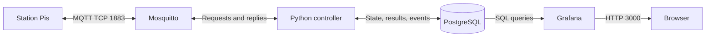

# Backend operations and database

[Back to the station MQTT guide](../README.md)

For station integration, use the README. This page covers deployment, stored
state, team registration, and Grafana queries.

## System overview



| Device | Project LAN address |
| --- | --- |
| Backend / MQTT broker | `192.168.1.11` |
| Station 01 / 02 / 03 / 04 / 05 | `192.168.1.21` / `.22` / `.23` / `.24` / `.25` |

## Database schema


`gameController/gameLogic.py` owns action validation, transition rules, team
checks, result/timing decisions, and handoff handling. `db.py` only handles
database queries, writes, and transactions. The logic runs its checks while the
database transaction holds the station row lock, so competing requests cannot
invalidate a check before the corresponding writes commit. `main.py` starts
game initialization, the controller MQTT client, and separate network threads
for the server-time and communication test services.

Alembic revision `0002_station_state` defines persistent station state and a
separate event history for Grafana. The controller reads and updates these tables
directly, with no in-memory station-state cache. Revision `0003_result_timing`
provides `started_at` and `completed_at`; the controller records these timestamps
on accepted start and complete actions. Revision `0004_team_rounds` adds `round`
to events, results, and occupied station state. Existing records become round 1;
existing idle stations keep a null round. Apply this migration to an existing
database without deleting its volume.
Revision `0005_station_states` converts station states without deleting data:
`login -> logged_in`, `start -> running`, and `complete/review -> reviewing`.
Existing saved review scores distinguish pending handoffs from teams still
entering a review. Downgrading this revision restores the old state names.
Revision `0006_team_identifiers` uses `team.id` for the scanned chip ID and
`team.name` for the unique team name. It converts existing game references to
team names and seeds the five former config mappings once, without an extra column. Migrations `0001`
through `0004` already on main remain unchanged.
`results.status` continues to record the latest accepted action (`login`, `start`,
`complete`, `review`), as does `station_events.event_type`; these are not the
station's live state.
Chip IDs (`team.id`) and station IDs are `VARCHAR(50)` strings. Unique team
names (`team.name`) and game-table `team_id` columns are `VARCHAR(255)` strings;
for example, `AA BB CC 01` maps to `Team-01`. `station_state` uses
`team_id` for the assigned team. Only the event row counter (`station_events.id`)
identifies an event. The new `round` column is a positive integer scoped to a team,
not a globally shared round counter.
The older revisions originally targeted a fresh string-ID schema. Upgrade from
the current main schema with `alembic upgrade head`; no volume reset is needed
for the new station states.

| Table | Purpose |
| --- | --- |
| `team` | Unique, non-null primary key `id` for the scanned chip (e.g. `AA BB CC 01`) and unique, non-null `name` (e.g. `Team-01`). |
| `station` | String primary key `station_id` such as `station01`, plus its name. |
| `station_state` | One current-state row per station: `status`, `team_id`, `round`, `review_score`, and `updated_at`. Idle stations have no team or round. |
| `results` | One result per team/round/station: `started_at`, `completed_at`, review, and result status. Earlier rounds remain available. |
| `station_events` | Event history for Grafana: timestamp, station username (e.g. `station01`), team name, `round`, event type, and optional review score. Existing rows are preserved. |

PostgreSQL is the source of truth for teams and their scanned identifiers.
The resolved team name is used consistently in `team.name`,
`results.team_id`, `station_state.team_id`, and `station_events.team_id`.
The station string is used consistently in every `station_id` column.
Startup initializes station names from their IDs but never creates or overwrites
teams. The migration seeds `AA BB CC 01` through `AA BB CC 05` for `Team-01`
through `Team-05`. Manage teams directly in PostgreSQL, for example:

```sql
-- Replace a chip without changing its team's identity or saved results.
UPDATE team SET id = 'AA BB CC 06' WHERE name = 'Team-01';

-- Register another team with any non-empty string identifier.
INSERT INTO team (id, name)
VALUES ('another-chip-format', 'Team-06');
```

Changes apply on the next login without a controller restart. Identifiers are
case-sensitive strings, not parsed hex bytes or a PostgreSQL UUID type. Internal
spaces are significant (`AA BB CC 01` differs from `AABBCC01`); surrounding request
whitespace is stripped, so store identifiers without leading/trailing whitespace.
Both `id` and `name` must be unique and non-null. The JSON login field remains
`uuid` for compatibility. Only `team.id` stores the scanned chip ID. The existing
`team_id` fields in MQTT replies, states, results, and Grafana events contain the
team **name**. Results and station state reference `team.name` with foreign keys;
renaming a team updates these references automatically. Event names stay as
historical snapshots. Grafana joins game records to `team.name`, not the chip ID.

`station_state` accepts only `idle`, `logged_in`, `running`, and `reviewing`.
An idle station has no team; every other state requires a known team name.
Only `reviewing` may have a saved score (0, 1, or 2) while its handoff is pending.
No next-station destination is stored in this table. The planned routing logic will choose a free station when the team
finishes; the current controller still uses the temporary sequential routing rule.
State transitions and acknowledgement handling remain controller responsibilities.
The controller locks the station and team rows, checks the action against the current
state, and writes state, result, and event in one transaction. The team lock also
serializes round decisions when requests arrive at different stations. It refreshes
`updated_at` on each state change and sends a success reply only after commit.
Failed writes roll back together; duplicate or out-of-order actions add no event.

### Current state, results, and events

`station_state` is the live snapshot: **what is happening at this station now?**
Its single row for a station is updated as that station moves through the game.
For example, station01 can show `status = running` and `team_id = Team-01`.
After the next-station handoff, that same row becomes `idle`, with no team
or review score, and with `round = NULL`. It does not keep previous visits.

`results` describes **how a particular team did at a particular station in one round**.
`started_at` is set when `start` is accepted, and `completed_at` when `complete`
is accepted. Both are timezone-aware timestamps. Login waiting time and review
time are excluded. Before starting, both are null; during play, only `started_at`
is filled. A completion requires a start and cannot precede it. No separate
duration column is needed: duration is `completed_at - started_at`.
The primary key is `(team_id, round, station_id)`. Before accepting
login, the controller checks that round's result under the station and team locks.
A result with `completed_at` set, or status `complete`/`review`, blocks another visit
by the same team in that round. Only a missing or unfinished result can be initialized on login.
Rejected repeat visits do not change any state, result, or event rows.

The controller reads the team's latest round from its saved results. When every
configured station has a completed result with status `review`, the next accepted
login creates a result in `round + 1`. The increment and login are one transaction,
so a rejected or failed login cannot advance the round. Restarting the controller
preserves this history. One team's new round does not advance another team's round.

For example, Team-01's first five visits generate round-1 events. After the final
review, the next login at station01 generates a round-2 event and a separate
round-2 result. All subsequent transitions for that visit use round 2. An old
handoff acknowledgement still logs `idle` under its original visit's round, even
if the team has already started its next round at another station.

`station_events` is the chronological history: **what changed, and when?**
Each accepted transition adds a new row instead of replacing the previous one.
For example, Team-01 can have `login` at 14:00, `start` at 14:01, `complete` at
14:04, and later `review` and `idle` events. The result retains the three-minute
playing time even after the live station state is reset. An `idle` event keeps
the finishing team's name and round for history; the live idle state has neither.

The controller performs these writes:

| Accepted transition | `station_state` | `results` | `station_events` |
| --- | --- | --- | --- |
| `login` | Set team, round, and `logged_in`. | Start a new round if all stations were reviewed; otherwise reject a replay in this round. Create or reset its unfinished result. | Append `login` with the accepted round. |
| `start` | Set `running`. | Set `started_at` and result status. | Append `start`. |
| `complete` | Set `reviewing`. | Set `completed_at` and result status. | Append `complete`. |
| `review` | Keep `reviewing` and save score until handoff. | Save review and result status. | Append `review` with score. |
| Handoff acknowledged | Set `idle` and clear team, round, and score. | Keep the finished result and its times. | Append `idle` with the finishing team's round. |

Each transition uses the same database timestamp for its state, result, and
event writes. A status query only reads committed state and does not create an
event. MQTT message IDs are kept locally to match acknowledgements to reviews;
they are not the game state. An acknowledgement for an older review cannot
release a newer visit. On reconnect, pending handoffs are found in the database.
If PostgreSQL is unavailable, requests receive an error rather than an invented
idle state; a failed handoff release stays in `reviewing` until a reconnect retries it.

At startup, the controller adds station names from `STATION_COUNT` and missing
idle state rows. Existing occupied states, results, and database-managed team
mappings are preserved. Old event history is not used to guess
state for a database that predates the state table. Existing team names must be
unique before applying this migration.
Existing result timestamps must also satisfy the timing rule before applying
`0003_result_timing`; inconsistent records are not silently rewritten.

Apply migrations before starting the updated controller (PostgreSQL must be running):

```sh
docker compose stop game-controller
docker compose build backend
docker compose run --rm --no-deps backend true
docker compose up -d --build mosquitto game-controller
```

The `backend` service runs `alembic upgrade head` once and exits successfully.
Compose waits for that success before starting `game-controller`. Both Alembic
and the controller use the database settings in `gameController/config.py`,
overridden by `DB_HOST`, `DB_PORT`, `DB_NAME`, `DB_USER`, and `DB_PASSWORD`.
Compose supplies the same PostgreSQL credentials to both services.

Start or update the stack with `docker compose up -d --build`. For local
execution, install `requirements.txt` and `tzdata` (needed where system timezone
data is absent), run `alembic upgrade head` from the project root, then run
`python gameController/main.py` with the same DB environment.
The controller no longer creates or changes tables itself.
The migration removes any old `team.signature` values. A downgrade recreates an
empty signature column and drops `station_state`, but deliberately keeps the
event history because the current controller still uses it.
Downgrading `0004_team_rounds` is refused once round-2 or later records exist,
because the old schema cannot keep multiple rounds of results.

For a Grafana table panel showing the event history:

```sql
SELECT created_at AS "time", station_id, team_id AS team_name,
       "round", event_type AS action, review_score
FROM station_events
WHERE $__timeFilter(created_at)
ORDER BY created_at DESC, id DESC;
```

For a Grafana table panel showing completed playing times per team and station:

```sql
SELECT r.completed_at AS "time", t.name AS team_name, s.name AS station_name,
       r."round", r.started_at, r.completed_at,
       EXTRACT(EPOCH FROM (r.completed_at - r.started_at)) AS duration_seconds
FROM results AS r
JOIN team AS t ON t.name = r.team_id
JOIN station AS s ON s.station_id = r.station_id
WHERE r.completed_at IS NOT NULL AND $__timeFilter(r.completed_at)
ORDER BY r.completed_at DESC, t.name, s.name;
```

Set the `duration_seconds` field unit to seconds in Grafana. The panel shows
results as soon as the controller accepts a complete action.

For a table panel showing the current station state:

```sql
SELECT s.name AS station, ss.team_id, ss.status, ss.review_score, ss.updated_at
FROM station_state AS ss
JOIN station AS s ON s.station_id = ss.station_id
ORDER BY s.station_id;
```

Enable the dashboard refresh interval to show new events and current states.
Do not time-filter the current-state panel: an occupied station must remain
visible even when its last change happened outside the dashboard time range.

## Grafana setup

Open `http://localhost:3000` on the backend host, or `http://192.168.1.11:3000`
from a station. The Compose defaults are `admin` / `admin`.
The [datasource](../grafana/provisioning/datasources/postgres.yml) and
[dashboards](../grafana/dashboards) are provisioned automatically.

For a manual datasource, use these Compose defaults:

| Setting | Value |
| --- | --- |
| Host | `postgres:5432` |
| Database | `stations` |
| Username / password | `stationuser` / `changeme` |
| TLS/SSL | Disabled |

Use the actual `POSTGRES_*` environment settings if overridden.

## Broker logs

```sh
docker compose logs -f mosquitto
```

Connection entries identify the source IP, MQTT client ID, and username. Message
entries identify the client ID and topic. Match them to see which device sent a
request. NAT or Docker networking may hide the original IP. The controller
itself receives the topic and payload, not the sender's socket address.
Logs also exist at `/mosquitto/log/mosquitto.log` inside the broker container.

## Independent helper services

Server time and communication checks start inside the game-controller container
using separate MQTT clients. They do not access the game database. For standalone
use, set `MQTT_HOST` and run `python gameController/servertime.py` or
`python gameController/communication_test.py`. Run only one responder per service;
the legacy `mqtt-test` time responder would produce additional replies.
