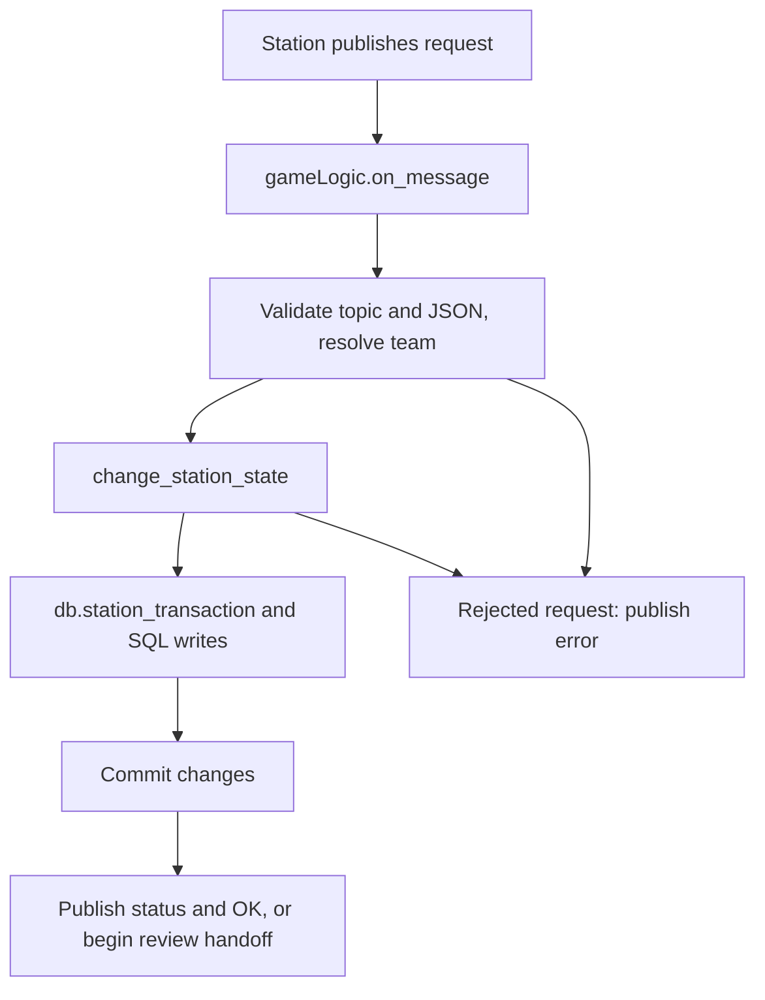
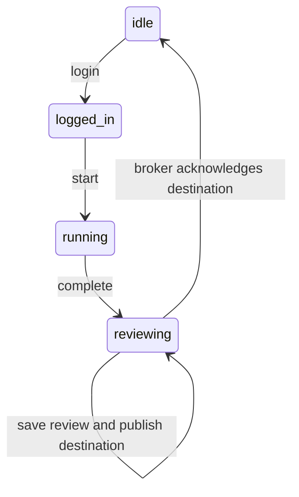
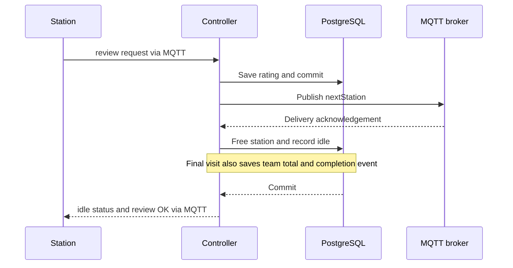

# Game logic: code navigation guide

[Station MQTT protocol](../README.md) · [Database and deployment](backend.md)

The controller decides whether an action is allowed. PostgreSQL stores the game
state. MQTT carries requests and replies. The client scripts simulate station
devices; they do not own the game rules.

Function names below are the best search terms in your IDE. Line links refer to
the code at the time this guide was written and may move as the project changes.

## 1. Which file owns what?

| File | Responsibility | Start reading here |
| --- | --- | --- |
| [gameController/main.py](../gameController/main.py#L10) | Starts the controller and independent helper services, registers MQTT callbacks | `main()` |
| [gameController/gameLogic.py](../gameController/gameLogic.py#L73) | Validates gameplay, changes states, chooses destinations, handles handoffs | `on_message()` and `change_station_state()` |
| [gameController/db.py](../gameController/db.py#L97) | SQL, transactions, locking, results, scores, event history | `station_transaction()` |
| [gameController/config.py](../gameController/config.py) | Broker/database connection settings | `MQTT_*`, `DB_CONFIG` |
| [gameController/servertime.py](../gameController/servertime.py#L25) | Berlin timestamp requests | `on_message()` |
| [gameController/communication_test.py](../gameController/communication_test.py#L19) | Plain `1` request and `2` reply | `on_message()` |
| [gameClient/clientLogin.py](../gameClient/clientLogin.py#L20) | Sends a game action and collects its required replies | `send_request()` |
| [gameClient/clientStatus.py](../gameClient/clientStatus.py#L19) | Queries live station state | `request_status()` |
| [gameClient/clientAutoPlay.py](../gameClient/clientAutoPlay.py#L177) | Simulates concurrent teams and unfinished games | `main()`, `play_team()` |
| [gameClient/resetGame.py](../gameClient/resetGame.py#L17) | Administrative unlock or full game reset | `reset_database()`, `main()` |
| [alembic/versions](../alembic/versions) | Creates and upgrades database tables and seed data | Numbered migration files |
| [mosquitto/config/mosquitto.acl](../mosquitto/config/mosquitto.acl) | Restricts MQTT topic access by username | `station/%u/...` patterns |
| [docker-compose.yml](../docker-compose.yml) | Starts PostgreSQL, broker, migration service, controller, and Grafana | `backend`, `game-controller` services |

Station IDs/names/order come from the database `station` table. Team tag IDs come
from `team.id`. Neither catalog is maintained in controller configuration.

## 2. Startup and request entry point

[entrypoint.sh](../entrypoint.sh) runs `alembic upgrade head` in the `backend`
service. Compose waits for that service before starting the controller.

`main.main()` calls `gameLogic.init_game()`, which calls `db.init_db()`. This
checks expected database columns and inserts missing idle state rows for the
registered stations. Existing progress and catalog names stay unchanged.

The controller registers `on_connect`, `on_message`, and `on_publish`. It starts
the time/test services with their own MQTT clients, then enters `loop_forever()`.
`gameLogic.on_connect()` subscribes to game topics and resumes saved review
handoffs after a controller reconnect.

**Request parsing lives in [on_message()](../gameController/gameLogic.py#L292).**
It checks the topic shape, supported action, JSON object, retained flag, station,
identifier, and review score. Login resolves `uuid` through `db.get_team_name()`.
Later actions use the resolved game team name, such as `Team-01`.

`/status` requests are handled as reads and do not advance the game. Output topics
and independent helper topics are ignored by the game handler to avoid loops.

## 3. The station state machine

The transition maps are at the top of
[gameLogic.py](../gameController/gameLogic.py#L11):

- `NEXT_ACTION`: which action is allowed from the current state.
- `ACTION_STATE`: which live state is saved for an accepted action.

Actions and states are different: `complete` is an action, while `reviewing` is
the resulting state. A saved review also remains `reviewing` until handoff ends.
There is no station MQTT action that directly sets `idle`.

## 4. A visit, action by action

All gameplay writes pass through
[change_station_state()](../gameController/gameLogic.py#L73).

| Action | What the function does | Relevant database helpers |
| --- | --- | --- |
| `login` | Requires an idle station and a team with no other assignment. Checks replay protection, possibly clears a finished previous game, creates the new result, assigns the team | `lock_team`, `get_team_station`, `get_reviewed_stations`, `clear_team_results`, `get_result`, `save_result` |
| `start` | Requires `logged_in` and the same team. Records `started_at`, sets `running` | `get_timestamp`, `save_result` |
| `complete` | Requires `running` and the same team. Records `completed_at`, sets `reviewing`, updates the station's fastest time | `save_result`, `save_high_score` |
| `review` | Requires `reviewing` and an unsaved review. Accepts integer score 0, 1, or 2. Saves the rating but keeps the station occupied | `get_result`, `save_result` |
| Internal `idle` | Checks the saved review and matching handoff timestamp. Frees the station. If all stations are reviewed, saves the team total and completion event | `save_station_state`, `save_team_high_score`, `log_event` |

Every accepted transition also writes an event. One database timestamp is used
for that transition's related writes. Login's `created_at` is not the start of
playing time: only `started_at` to `completed_at` counts toward highscores.

`results.status` stores the latest action (`login`, `start`, `complete`, `review`).
`station_state.status` stores the live state. To distinguish an entered review
screen from a submitted review, inspect `results.status`.

## 5. Rules that prevent invalid games

These checks are inside `change_station_state()`, before a successful commit:

| Rule | Implementation | Error |
| --- | --- | --- |
| An occupied station cannot accept another login | Compare `NEXT_ACTION` with the requested action | `STATION_BUSY` |
| One team cannot occupy two stations | Lock the team and call `db.get_team_station()` | `TEAM_BUSY` |
| Actions must follow the state order | `NEXT_ACTION` lookup | `INVALID_STATE` |
| Only the assigned team may advance a visit | Compare the requested team with the live row | `TEAM_MISMATCH` |
| A completed station cannot be replayed during an unfinished game | Check its result's `completed_at` and status | `STATION_ALREADY_COMPLETED` |
| A submitted review cannot be submitted again | Check `results.status == 'review'` | `INVALID_STATE` |
| A score must be an integer 0, 1, or 2 | Exact integer type and range check | `INVALID_REVIEW_SCORE` |

[db.station_transaction()](../gameController/db.py#L97) locks the station row
with `FOR UPDATE`. [db.lock_team()](../gameController/db.py#L112) serializes
requests for the same team, even at different stations. Exceptions roll back
the transaction, so rejected actions do not partly change results or occupancy.

## 6. Routing and the review handoff

**Destination selection:**
[choose_next_station()](../gameController/gameLogic.py#L202), using
[db.get_routing_snapshot()](../gameController/db.py#L74).

The snapshot reads station availability, the team's results, and event numbering
consistently. Stations are ordered by `routing_order`, then `station_id`.
Starting after the current station and wrapping around, routing:

1. Skips the current station and stations this team already completed.
2. Chooses the first free, unfinished station (`available`).
3. If none is free, suggests an occupied, unfinished station (`queued`).
4. Returns `round_complete` with a null destination if every station is reviewed.
5. Otherwise returns `no_available_station` with a null destination.

A suggestion does not reserve a station. Login still validates availability.

**Delivery and release:**
[send_next_station()](../gameController/gameLogic.py#L246) publishes the result
and stores its MQTT message ID in `pending_next_stations`.
[on_publish()](../gameController/gameLogic.py#L265) processes the broker's ACK.

The ACK confirms broker receipt, not that the physical station displayed the
destination. `expected_updated_at` prevents an old ACK from releasing a newer
visit. On failure, the saved review stays available for controller reconnect
recovery. A station's own status query does not replay a missed destination.

## 7. Finishing a game and reusing the tag

There are two separate moments in `change_station_state()`:

| Moment | Effect |
| --- | --- |
| Final review handoff acknowledged | Free the final station, save the team total, append `round_complete`. Keep all current results visible. |
| Same team's next accepted login at a free station | If every configured station is reviewed, delete only that team's current results and create its new login in the same transaction. |

The second step is the automatic “nullification.” An invalid or busy login does
not clear results. Events and both highscore tables survive the new game.

[event_round()](../gameController/gameLogic.py#L66) and
[db.get_latest_team_event()](../gameController/db.py#L130) determine the game
number from events and saved team scores. Login after completion advances it.
Preserved scores prevent number reuse after an administrative reset.

`round` exists in `station_events`, `high_score_team`, and routing replies.
It does not exist in the current `results` or `station_state` tables.

## 8. Where highscores are calculated

| Score | Function | Calculation and write point |
| --- | --- | --- |
| Fastest attempt at a station | [db.save_high_score()](../gameController/db.py#L158) | `completed_at - started_at`, on accepted `complete`. Replaces the winner only when faster. Equal times keep the existing winner. |
| Completed game for a team and round | [db.save_team_high_score()](../gameController/db.py#L169) | Sum of playing times at all stations, on the final review handoff. No walking, waiting, or review time. |

`high_score` has one row per station. `high_score_team` has one row per
`(team_name, round)`, so it retains multiple games rather than only a single best
game per team. Ranking or selecting each team's best game is a dashboard query.
Durations are PostgreSQL `INTERVAL` values. A partial game has station results
and may earn station records, but does not get a team total yet.

## 9. Replies and errors

| Function in `gameLogic.py` | Purpose |
| --- | --- |
| `publish_json()` | Common JSON publishing, QoS 1, `retain=false` |
| `send_status()` | Publish live `status` and `team_id` on `/status` |
| `send_return()` | Publish `OK` or `ERROR` on `/error`, including the action |
| `send_error()` | Convenience wrapper for rejection replies |
| `ERROR_MESSAGES` and `RequestRejectedError` | Error-code text and expected request rejection |

Login/start/complete send status and OK after commit. Review sends its final OK
only after handoff and idle commit. A validation error preserves existing state;
a `HANDOFF_ERROR` can follow a review that was already saved.

[clientLogin.send_request()](../gameClient/clientLogin.py#L20) subscribes first,
waits for SUBACK, publishes the action, and collects matching replies. For review
it waits for the route, idle status, and review OK. Client timeouts do not reset
the database and do not prove that a request was rejected.

## 10. Test tools and administrative reset

The helpers use separate MQTT connections and are started by `main.py`:

- `servertime.on_message()`: JSON GET to `/servertime`, Berlin ISO timestamp and
  Unix timestamp back on the same topic.
- `communication_test.on_message()`: plain `1` to `/test`, plain `2` back. It does
  not access game state or prove the database is healthy.

In `clientAutoPlay.py`, settings and `TEAMS` are at the top. `main()` schedules
four workers. `play_team()` follows routing, `simulate_play()` adds the 2–10
second delay, and per-station locks prevent overlapping simulated visits.
Team-01 and Team-02 finish. `FULL_GAMES_DONE` waits for both before
`leave_partial_visit()` leaves Team-03 running and Team-04 reviewing at their
third stations. Waiting happens between visits so the finishing teams are not blocked.

`resetGame.main()` stops the Docker controller, runs `reset_database()` inside
the backend container, and starts the broker/controller again. `--station`
frees the station without changing results, preserving events and adding a
reset event. `--all` clears live progress/events for every team. Both preserve
highscores and the team/station catalogs. Run it on the Docker host.

## 11. Database migrations and tests

| Migration | Why it matters to current gameplay |
| --- | --- |
| `0001`–`0003` | Base tables, live state/events, explicit timing columns |
| `0004_team_rounds` | Introduced historical round columns; later migrations revise the live tables |
| `0005_station_states` | Introduced the current live state vocabulary |
| `0006_team_identifiers` | Chip IDs in `team.id`, game references to `team.name` |
| `0007_station_names` | Station catalog, game names, routing order |
| `0008_team_tag_uids` | The five physical tag registrations |
| `0009_high_score` | Station records, one current result per team/station, removes live round columns |
| `0010_remove_state_review` | Removes duplicate score storage from live station state |
| `0011_high_score_team` | Creates the team/round duration table |
| `0012_team_score_constraints` | Validates team scores and backfills retained completed games |

[tests/test_team_high_scores.py](../tests/test_team_high_scores.py) verifies
migration/backfill, duration sums, retained faster station records, rollback on
failed team-score writes, repeated ACK handling, and reset numbering. It requires
an isolated `DB_NAME=team_scores_test` database. It does not test the full MQTT
network or Grafana rendering.

## 12. Quick lookup when changing behavior

| I want to change… | Look here |
| --- | --- |
| Accepted payloads or request errors | `gameLogic.on_message`, `ERROR_MESSAGES`, client `send_request` |
| Allowed actions and state transitions | `NEXT_ACTION`, `ACTION_STATE`, `change_station_state` |
| Team/station occupancy or replay protection | Login branch in `change_station_state`, `db.lock_team`, `db.get_team_station` |
| When previous results disappear | Login branch calling `db.clear_team_results` |
| Station order or game names | Database `station` rows; `db.get_station_ids` |
| Destination selection | `choose_next_station`, `db.get_routing_snapshot` |
| When a station becomes idle | `on_publish` and internal idle branch in `change_station_state` |
| Timing or ranking data | Complete/idle branches, `save_high_score`, `save_team_high_score` |
| Tag assignments | Database `team.id`; `db.get_team_name` |
| Number of simulated players or stop states | Auto-play `TEAMS`, `main`, completion events and validation |
| Broker access or authentication | Mosquitto ACL and Dockerfile account generation |
| Display/layout | Grafana dashboard files; game logic supplies the underlying data |

For a first read, follow **`main.main` → `on_message` → `change_station_state`
→ `db.station_transaction`**, then read **`choose_next_station` →
`send_next_station` → `on_publish`** for the review handoff.
